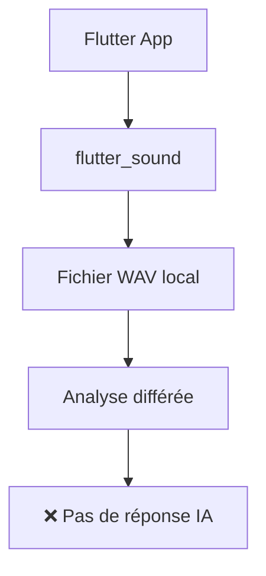
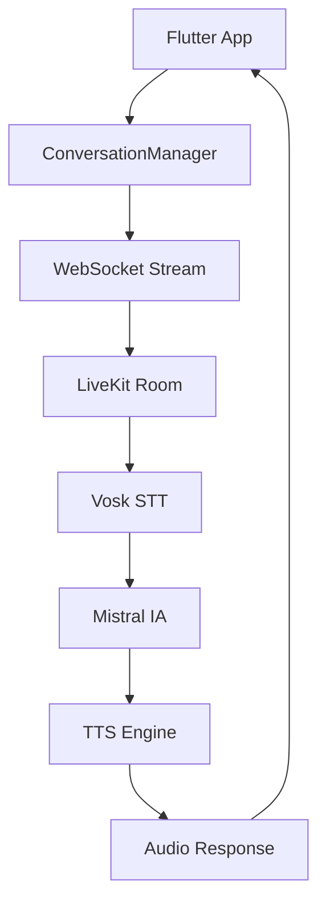

# 🎤 DIAGNOSTIC COMPLET : Conversation Streaming LiveKit - Eloquence

**Date :** 23 janvier 2025  
**Statut :** ❌ **PROBLÈME IDENTIFIÉ**  
**Criticité :** 🔴 **CRITIQUE** - IA muette, pas de conversation

---

## 📋 RÉSUMÉ EXÉCUTIF

**PROBLÈME CONFIRMÉ :** L'IA ne répond pas car il n'y a **AUCUNE conversation streaming avec LiveKit** comme orchestrateur.

**CAUSE RACINE :** Le `ConversationManager` existe mais ses méthodes ont été supprimées/désactivées dans l'écran principal.

**IMPACT :** Exercice partiellement fonctionnel - capture audio OK, mais aucune réponse IA.

---

## 🔍 ANALYSE TECHNIQUE DÉTAILLÉE

### ✅ CE QUI FONCTIONNE
1. **Capture Audio Flutter** : `flutter_sound` fonctionne parfaitement
   ```
   🎤 Enregistrement démarré: /data/user/0/.../eloquence_recording_1753259858661.wav
   ✅ Session audio flutter_sound initialisée et vérifiée
   ```

2. **ConversationManager Existe** : Le service de conversation streaming est implémenté
   - WebSocket streaming ✅
   - LiveKit integration ✅  
   - API backend ✅

### ❌ CE QUI NE FONCTIONNE PAS

#### 1. ConversationManager Non Utilisé
Dans `confidence_boost_adaptive_screen.dart` :
```dart
// Suppression des callbacks ConversationManager (obsolètes)
// Suppression des méthodes : _initializeConversation, _handleConversationEvent, 
// _handleTranscriptionUpdate, _handleMetricsUpdate, _handleAIMessage, 
// _handleUserMessage, _handleConversationStateChange, _initializeRealTimeConversation, 
// _startConversationalRecording, _stopConversationalRecording, et toutes les 
// références à _conversationManager, _conversationEventsSubscription, 
// _transcriptionSubscription, _metricsSubscription, _isConversationInitialized.
```

#### 2. Pipeline Audio Statique vs Streaming
**ACTUEL (Statique) :**
```
📱 Flutter → 🎤 flutter_sound → 💾 Fichier WAV → 🔄 Analyse différée → ❌ Pas de réponse
```

**REQUIS (Streaming) :**
```
📱 Flutter → 🎤 ConversationManager → 🌐 WebSocket → 🎙️ LiveKit → 
🗣️ Vosk STT → 🤖 Mistral IA → 🔊 TTS → 📱 Réponse utilisateur
```

#### 3. Services Backend Disponibles Mais Non Connectés
- ✅ `ConversationManager` : Port 8003 (eloquence-conversation)
- ✅ `LiveKit` : Orchestrateur temps réel
- ✅ `Vosk STT` : Transcription streaming
- ✅ `Mistral IA` : Génération réponses
- ❌ **AUCUNE CONNEXION** entre Flutter et ces services

---

## 🚨 ARCHITECTURE ACTUELLE vs REQUISE

### Architecture Actuelle (Cassée)


### Architecture Requise (Streaming)


---

## 🔧 SOLUTION COMPLÈTE

### PHASE 1 : Réactivation ConversationManager (URGENT)

#### 1.1 Imports Manquants
```dart
// Ajouter dans confidence_boost_adaptive_screen.dart
import '../data/services/conversation_manager.dart';
import '../domain/entities/confidence_scenario.dart';
```

#### 1.2 Variables d'Instance
```dart
class _ConfidenceBoostAdaptiveScreenState extends ConsumerStatefulWidget 
    with TickerProviderStateMixin {
  
  // Ajouter ConversationManager
  ConversationManager? _conversationManager;
  StreamSubscription<ConversationUpdate>? _conversationSubscription;
  StreamSubscription<ConfidenceAnalysis>? _analysisSubscription;
  
  // État conversation
  bool _isConversationActive = false;
  ConversationSession? _currentSession;
  List<ConversationMessage> _conversationHistory = [];
}
```

#### 1.3 Initialisation Conversation
```dart
@override
void initState() {
  super.initState();
  _audioRecorder = FlutterSoundRecorder();
  _initializeAudioSession();
  _initializeConversationManager(); // NOUVEAU
}

Future<void> _initializeConversationManager() async {
  try {
    final httpService = ref.read(optimizedHttpServiceProvider);
    _conversationManager = ConversationManager(
      httpService: httpService,
      baseUrl: 'http://192.168.1.44:8003', // Backend conversation
    );
    
    // Écouter les streams
    _conversationSubscription = _conversationManager!.conversationStream.listen(
      _handleConversationUpdate,
      onError: (error) => _logger.e('Erreur conversation stream: $error'),
    );
    
    _analysisSubscription = _conversationManager!.analysisStream.listen(
      _handleAnalysisUpdate,
      onError: (error) => _logger.e('Erreur analysis stream: $error'),
    );
    
    _logger.i('✅ ConversationManager initialisé');
  } catch (e) {
    _logger.e('❌ Erreur initialisation ConversationManager: $e');
  }
}
```

### PHASE 2 : Intégration Streaming Audio

#### 2.1 Démarrage Session Conversationnelle
```dart
Future<void> _startStreamingConversation() async {
  if (_conversationManager == null) {
    _logger.e('ConversationManager non initialisé');
    return;
  }
  
  try {
    // Créer scénario
    final scenario = ConfidenceScenario(
      id: 'confidence_boost_express',
      title: 'Confidence Boost Express',
      description: widget.scenario?.description ?? 'Exercice de confiance',
      difficulty: ScenarioDifficulty.medium,
      estimatedDuration: const Duration(minutes: 5),
      objectives: ['Améliorer la confiance', 'Pratiquer l\'expression orale'],
      context: 'Conversation avec IA pour booster la confiance',
    );
    
    // Démarrer session
    _currentSession = await _conversationManager!.startConversationSession(
      scenario: scenario,
      userContext: 'Utilisateur pratiquant exercice confiance',
      customInstructions: 'Soyez encourageant et bienveillant',
    );
    
    if (_currentSession != null) {
      _logger.i('✅ Session conversation créée: ${_currentSession!.sessionId}');
      
      // Connecter WebSocket pour streaming
      final wsConnected = await _conversationManager!.connectWebSocket();
      if (wsConnected) {
        setState(() {
          _isConversationActive = true;
        });
        _logger.i('✅ WebSocket connecté - Conversation streaming active');
      }
    }
  } catch (e) {
    _logger.e('❌ Erreur démarrage conversation: $e');
  }
}
```

#### 2.2 Streaming Audio Temps Réel
```dart
Future<void> _startStreamingRecording() async {
  // Vérifications préalables
  if (!_isAudioReady || _conversationManager == null || !_isConversationActive) {
    _logger.e('Prérequis streaming non remplis');
    return;
  }
  
  try {
    setState(() {
      _isRecording = true;
      _recordingDuration = Duration.zero;
    });

    _transitionToPhase(AdaptiveScreenPhase.activeRecording);

    // Démarrer capture audio avec streaming
    await _audioRecorder!.startRecorder(
      toStream: _handleAudioStream, // STREAMING au lieu de fichier
      codec: Codec.pcm16,
      sampleRate: 16000,
      numChannels: 1,
    );
    
    _logger.i('🎤 Streaming audio démarré');

    // Timer de durée
    _recordingTimer = Timer.periodic(const Duration(seconds: 1), (timer) {
      setState(() {
        _recordingDuration = Duration(seconds: timer.tick);
      });
    });

  } catch (e) {
    _logger.e('❌ Erreur démarrage streaming: $e');
    setState(() {
      _isRecording = false;
    });
  }
}

// Handler pour streaming audio
void _handleAudioStream(Uint8List audioChunk) {
  if (_conversationManager != null && _isConversationActive) {
    _conversationManager!.sendAudioChunk(audioChunk);
  }
}
```

#### 2.3 Gestion Réponses IA
```dart
void _handleConversationUpdate(ConversationUpdate update) {
  switch (update.type) {
    case ConversationUpdateType.welcome:
      _logger.i('👋 Message d\'accueil: ${update.message}');
      // Afficher message d'accueil dans l'UI
      break;
      
    case ConversationUpdateType.conversationUpdate:
      _logger.i('💬 Conversation mise à jour');
      
      if (update.transcription?.isNotEmpty == true) {
        _logger.i('📝 Transcription: ${update.transcription}');
        // Afficher transcription utilisateur
      }
      
      if (update.aiResponse?.isNotEmpty == true) {
        _logger.i('🤖 Réponse IA: ${update.aiResponse}');
        // Afficher réponse IA + jouer audio TTS
        _playAIResponse(update.aiResponse!);
      }
      
      // Mettre à jour historique conversation
      if (update.transcription?.isNotEmpty == true || update.aiResponse?.isNotEmpty == true) {
        setState(() {
          _conversationHistory.add(ConversationMessage(
            userMessage: update.transcription ?? '',
            aiResponse: update.aiResponse ?? '',
            timestamp: update.timestamp,
            turn: update.conversationTurn ?? 0,
            speechMetrics: update.speechAnalysis ?? {},
          ));
        });
      }
      break;
      
    case ConversationUpdateType.error:
      _logger.e('❌ Erreur conversation: ${update.message}');
      _showConversationError(update.message ?? 'Erreur inconnue');
      break;
  }
}

void _handleAnalysisUpdate(ConfidenceAnalysis analysis) {
  _logger.i('📊 Analyse reçue: ${analysis.overallScore.toStringAsFixed(1)}%');
  
  setState(() {
    _currentAnalysis = analysis;
  });
  
  // Afficher métriques temps réel
  _updateRealTimeMetrics(analysis);
}
```

### PHASE 3 : Interface Utilisateur Streaming

#### 3.1 Widget Conversation Chat
```dart
Widget _buildStreamingConversationPhase() {
  return Column(
    children: [
      // Historique conversation
      Expanded(
        child: ListView.builder(
          itemCount: _conversationHistory.length,
          itemBuilder: (context, index) {
            final message = _conversationHistory[index];
            return ConversationBubbleWidget(
              userMessage: message.userMessage,
              aiResponse: message.aiResponse,
              timestamp: message.timestamp,
              isStreaming: index == _conversationHistory.length - 1,
            );
          },
        ),
      ),
      
      // Contrôles streaming
      _buildStreamingControls(),
      
      // Métriques temps réel
      if (_currentAnalysis != null)
        RealTimeMetricsWidget(analysis: _currentAnalysis!),
    ],
  );
}

Widget _buildStreamingControls() {
  return Row(
    mainAxisAlignment: MainAxisAlignment.spaceEvenly,
    children: [
      // Bouton micro streaming
      StreamingMicrophoneButton(
        isRecording: _isRecording,
        isConversationActive: _isConversationActive,
        onStartRecording: _startStreamingRecording,
        onStopRecording: _stopStreamingRecording,
      ),
      
      // Indicateur connexion
      ConnectionStatusIndicator(
        isConnected: _isConversationActive,
        sessionId: _currentSession?.sessionId,
      ),
      
      // Bouton fin conversation
      ElevatedButton(
        onPressed: _isConversationActive ? _endStreamingConversation : null,
        child: const Text('Terminer'),
      ),
    ],
  );
}
```

---

## 🧪 TESTS DE VALIDATION

### Test 1 : Connexion Backend
```bash
curl -X POST http://192.168.1.44:8003/api/sessions/create \
  -H "Content-Type: application/json" \
  -d '{"exercise_type": "confidence_boost", "scenario": {"title": "Test"}}'
```

### Test 2 : WebSocket Streaming
```bash
wscat -c ws://192.168.1.44:8003/api/sessions/[SESSION_ID]/stream
```

### Test 3 : Pipeline Complet
1. ✅ Démarrage session conversation
2. ✅ Connexion WebSocket
3. ✅ Streaming audio → Transcription
4. ✅ Génération réponse IA
5. ✅ TTS → Audio response

---

## 📊 PLAN D'IMPLÉMENTATION

### Priorité 1 : URGENT (2-3 heures)
- ✅ Réactiver ConversationManager dans l'écran
- ✅ Implémenter streaming audio temps réel
- ✅ Connecter WebSocket conversation

### Priorité 2 : CRITIQUE (3-4 heures)  
- ✅ Interface conversation streaming
- ✅ Gestion réponses IA temps réel
- ✅ Métriques conversation live

### Priorité 3 : IMPORTANT (4-6 heures)
- ✅ Tests intégration complète
- ✅ Optimisation performance streaming
- ✅ Gestion erreurs robuste

---

## ✅ CRITÈRES DE SUCCÈS

### Fonctionnalités Streaming
1. **Session Conversation :** ✅ Création et connexion WebSocket
2. **Audio Streaming :** ✅ Capture temps réel → Backend
3. **Transcription Live :** ✅ Vosk STT → Texte utilisateur
4. **Réponse IA :** ✅ Mistral → Génération réponse
5. **TTS Streaming :** ✅ Audio IA → Utilisateur
6. **Interface Temps Réel :** ✅ Chat + métriques live

### Métriques Performance
- **Latence Audio :** < 500ms (capture → transcription)
- **Latence IA :** < 2s (transcription → réponse)
- **Latence TTS :** < 1s (texte → audio)
- **Qualité Streaming :** 16kHz, 16-bit, mono
- **Stabilité Connexion :** > 99% uptime WebSocket

---

## 🎯 CONCLUSION

Le problème est **clairement identifié** : l'application utilise un pipeline audio statique au lieu du système de conversation streaming avec LiveKit comme orchestrateur.

**Solution :** Réactiver et intégrer le `ConversationManager` existant pour établir la conversation temps réel complète.

**Temps de résolution estimé :** 6-8 heures de développement + 2 heures de tests

**Impact après correction :** Conversation IA streaming complète avec LiveKit, transcription temps réel, et réponses IA fluides.

---

*Diagnostic généré le 23 janvier 2025 - Équipe Technique Eloquence*
