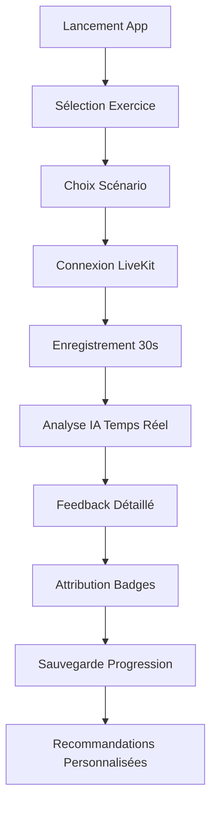
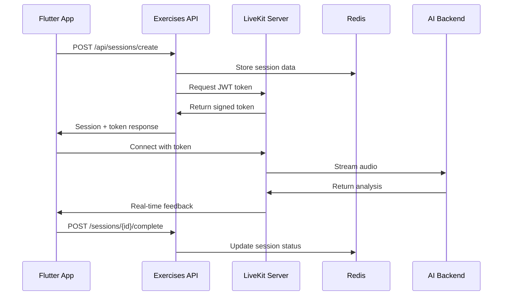

# 🎯 Eloquence - Concept et Architecture Globale

**Date :** 25 janvier 2025  
**Version :** 2.0  
**Objectif :** Documentation complète du concept et de l'architecture d'Eloquence

---

## 🎙️ QU'EST-CE QU'ELOQUENCE ?

**Eloquence** est une **plateforme d'entraînement vocal intelligente** qui révolutionne l'apprentissage de l'expression orale en combinant intelligence artificielle conversationnelle et analyse audio temps réel.

### 🌟 Vision du Projet

Eloquence permet à chaque utilisateur de **développer ses compétences de communication** à travers des exercices vocaux interactifs avec des agents IA spécialisés, offrant un feedback personnalisé et une progression adaptée.

### 🎯 Objectifs Principaux

1. **Démocratiser l'entraînement vocal** : Accès facilité aux techniques de communication
2. **Personnalisation IA** : Adaptation en temps réel au niveau et aux besoins de l'utilisateur
3. **Feedback immédiat** : Analyse vocale instantanée avec conseils d'amélioration
4. **Progression gamifiée** : Système de badges et défis pour maintenir la motivation
5. **Extensibilité** : Architecture permettant l'ajout rapide de nouveaux exercices

---

## 🚀 EXERCICES ET FONCTIONNALITÉS

### 🎭 Catalogue d'Exercices Disponibles

#### 1. **Confidence Boost Express** ⭐
- **Durée :** 30 secondes
- **Objectif :** Développer l'assurance personnelle
- **Fonctionnalités :**
  - 10 scénarios prédéfinis (social, professionnel, leadership)
  - Analyse vocale avec 4 métriques : confiance, fluidité, clarté, énergie
  - Système de badges progressifs
  - Tips contextuels personnalisés

#### 2. **Power Posing Boost**
- **Focus :** Postures de pouvoir et langage corporel
- **Techniques :** Wonder Woman, Victory V, CEO Lean
- **Coaching :** Intensité élevée avec feedback temps réel

#### 3. **Impromptu Speaking Master**
- **Objectif :** Maîtrise de l'improvisation orale
- **Méthode :** 30 secondes de préparation, structure spontanée
- **Catégories :** Objets, concepts, situations

#### 4. **Tongue Twister Speedrun**
- **Focus :** Articulation et diction
- **Progression :** Vitesse progressive adaptative
- **Types :** Sifflants, consonnes dures, liquides, nasales

#### 5. **Conversation Confiance**
- **Durée :** 10 minutes
- **Format :** Dialogue avec agent IA Marie
- **Scénarios :** Réunions, présentations, interactions sociales

### 🤖 Agents IA Conversationnels

- **Marie** : Coach principal, personnalité encourageante
- **Agents spécialisés** : Adaptés à chaque type d'exercice
- **Personnalité adaptative** : Ajustement selon le profil utilisateur

---

## 🏗️ ARCHITECTURE TECHNIQUE GLOBALE

### 📱 Vue d'Ensemble du Système

```
┌─────────────────────────────────────────────────────────────┐
│                    ELOQUENCE ECOSYSTEM                      │
├─────────────────────────────────────────────────────────────┤
│  📱 Flutter App (Mobile/Desktop)                           │
│  ├── 🎯 Exercises API (Port 8005) ← NOUVEAU                │
│  ├── 🎤 Universal LiveKit Service                          │
│  ├── 🧠 Neuroscience Engine                                │
│  └── 🎨 Glassmorphism Design System                        │
├─────────────────────────────────────────────────────────────┤
│  🌐 LiveKit Server (Port 7880)                             │
│  ├── 🔄 Audio Streaming Bidirectionnel                     │
│  ├── 🎙️ Real-time Transcription                           │
│  ├── 🤖 AI Agent Integration                               │
│  └── 🔐 JWT Token Management                               │
├─────────────────────────────────────────────────────────────┤
│  🧠 AI Backend Services                                     │
│  ├── 🗣️ Vosk STT (Transcription)                          │
│  ├── 🤖 Mistral LLM (Analyse & Coaching)                   │
│  ├── 🎵 TTS Engine (Réponses vocales)                      │
│  └── 📊 Analytics & Metrics                                │
├─────────────────────────────────────────────────────────────┤
│  💾 Persistance & Cache                                     │
│  ├── 🗃️ Redis (Sessions temps réel)                        │
│  ├── 🐘 Supabase (Base de données)                         │
│  └── 📈 Métriques & Progression                            │
└─────────────────────────────────────────────────────────────┘
```

### 🎯 Principe Architectural : "1 Service, Tous les Exercices"

L'architecture d'Eloquence repose sur le **service audio universel LiveKit** qui permet :
- **Connexion automatique** à LiveKit pour tous les exercices
- **Streaming bidirectionnel** avec latence < 100ms
- **Transcription temps réel** avec analyse IA
- **Interface uniforme** pour l'ajout de nouveaux exercices

---

## 🔧 STACK TECHNOLOGIQUE DÉTAILLÉE

### 📱 Frontend - Flutter

**Framework :** Flutter 3.x avec architecture Clean  
**Gestion d'état :** Riverpod  
**Navigation :** GoRouter  

#### Packages Clés
```yaml
dependencies:
  # Audio & Communication
  livekit_client: ^2.2.0
  flutter_sound: ^9.2.13
  
  # State Management
  flutter_riverpod: ^2.5.1
  
  # UI & Design
  glassmorphism: ^3.0.0
  
  # Persistence
  supabase_flutter: ^2.5.6
  hive: ^2.2.3
```

#### Architecture Flutter
```
lib/
├── core/
│   ├── services/
│   │   ├── universal_livekit_audio_service.dart ⭐
│   │   └── webrtc_initialization_service.dart
│   ├── mixins/
│   │   └── livekit_exercise_mixin.dart
│   └── theme/
│       └── eloquence_unified_theme.dart
├── features/
│   ├── confidence_boost/
│   ├── presentation_skills/
│   └── [nouveaux_exercices]/
└── presentation/
    ├── providers/
    └── widgets/
```

### 🌐 Backend - Services Microservices

#### 1. **Eloquence Exercises API** (Nouveau - Port 8005)
- **Framework :** FastAPI + Pydantic v2
- **Base de données :** Redis (sessions et cache)
- **Fonctionnalités :** CRUD exercices, gestion sessions LiveKit
- **Docker :** Image Python 3.11 optimisée

#### 2. **LiveKit Server** (Port 7880)
- **Technologie :** LiveKit WebRTC
- **Fonctions :** Streaming audio, gestion rooms, agents IA
- **Performance :** < 100ms latence, codec audio optimisé

#### 3. **AI Backend Services**
- **Vosk STT :** Transcription française temps réel
- **Mistral LLM :** Analyse conversationnelle et coaching
- **TTS Service :** Synthèse vocale pour les agents IA

#### 4. **Token Service** (Port 8004)
- **Sécurité :** Génération JWT pour LiveKit
- **Endpoint :** `/generate-token`
- **Métadonnées :** Configuration exercice et utilisateur

### 💾 Persistance et Cache

#### Base de Données Principale - Supabase
```sql
-- Tables principales
confidence_scenarios    (scénarios d'exercices)
confidence_sessions     (historique utilisateur)
user_profiles          (profils et progression)
exercise_templates     (templates d'exercices)
```

#### Cache Redis
- **Sessions actives :** Données temps réel
- **Configurations :** Templates et paramètres
- **Métriques :** Performance et analytics

---

## 🎨 DESIGN SYSTEM ET UX

### 🌌 Design Glassmorphism

**Philosophie :** Interface futuriste et immersive  
**Couleurs principales :**
- Navy : `#1A1F2E` (fond principal)
- Cyan : `#00D4FF` (accent principal)  
- Violet : `#8B5CF6` (accent secondaire)

**Composants :**
- `EloquenceGlassCard` : Cartes avec effet de flou
- `AnimatedMicrophoneButton` : Microphone interactif
- `AvatarWithHalo` : Représentation des agents IA

### 📱 Ergonomie Mobile Optimisée

**Thumb Zone Design :**
- Microphone principal à 200px du bas minimum
- Boutons d'action dans la zone accessible
- Navigation intuitive avec retour visuel

**Responsive Design :**
- Adaptation mobile, tablette, desktop
- Layouts flexibles selon l'orientation
- Performance optimisée sur tous les appareils

---

## 🚀 NOUVELLE API ELOQUENCE EXERCISES

### 🎯 Objectif de l'API

La **nouvelle API Eloquence Exercises** simplifie radicalement l'ajout de nouveaux exercices en fournissant une couche d'abstraction légère au-dessus de l'infrastructure LiveKit existante.

### 📋 Endpoints Disponibles

#### Gestion des Templates
```http
GET /api/exercise-templates
POST /api/exercise-templates
```

#### Gestion des Exercices
```http
POST /api/exercises
GET /api/exercises
GET /api/exercises/{exercise_id}
```

#### Gestion des Sessions LiveKit
```http
POST /api/sessions/create      ⭐ Création avec token JWT
GET /api/sessions/{session_id}
POST /api/sessions/{session_id}/complete
DELETE /api/sessions/{session_id}
```

#### Monitoring et Statistiques
```http
GET /health                    ⭐ Health check complet
GET /api/statistics           ⭐ Métriques d'utilisation
```

### 🔧 Intégration Docker

```yaml
# docker-compose.yml
services:
  eloquence-exercises-api:
    build: ./services/eloquence-exercises-api
    ports:
      - "8005:8005"
    depends_on:
      - redis
      - livekit-server
      - livekit-token-service
    environment:
      - REDIS_URL=redis://redis:6379/0
      - LIVEKIT_URL=ws://livekit-server:7880
      - TOKEN_SERVICE_URL=http://livekit-token-service:8004
```

### 🎯 Templates d'Exercices Prédéfinis

1. **Power Posing** : Postures de confiance
2. **Impromptu Speaking** : Improvisation orale  
3. **Tongue Twister** : Exercices d'articulation
4. **Conversation Confiance** : Dialogue avec IA

---

## 🧠 ANALYSE IA ET MÉTRIQUES

### 📊 Métriques Vocales Analysées

#### 1. **Confiance** (0-100)
- Assurance dans la voix
- Stabilité du débit
- Conviction du discours

#### 2. **Fluidité** (0-100)
- Régularité du débit
- Gestion des pauses
- Continuité du discours

#### 3. **Clarté** (0-100)
- Articulation des mots
- Structure des phrases
- Compréhensibilité

#### 4. **Énergie** (0-100)
- Enthousiasme vocal
- Dynamisme
- Engagement émotionnel

### 🤖 Pipeline d'Analyse IA

```
🎤 Audio Input
    ↓ (Real-time streaming)
🗣️ Vosk STT (Transcription)
    ↓ (Text + Audio features)
🧠 Mistral LLM (Analysis)
    ↓ (Structured feedback)
📊 Metrics Generation
    ↓ (Scores + Recommendations)
📱 Flutter UI Display
```

---

## 🎮 SYSTÈME DE GAMIFICATION

### 🏆 Badges et Récompenses

#### Badges Confidence Boost
1. **Premier Pas** : Premier exercice complété
2. **Confiant** : Score confiance > 70
3. **Éloquent** : Score global > 80
4. **Maître Orateur** : 10 exercices parfaits
5. **Improvisateur** : Excellent en spontané
6. **Coach Personnel** : 50 exercices complétés
7. **Légende** : Top 10% des utilisateurs
8. **Mentor** : Aide d'autres utilisateurs

#### Système de Progression
- **Points XP** : Basés sur performance et régularité
- **Niveaux** : Débutant → Intermédiaire → Avancé → Expert
- **Défis** : Objectifs quotidiens et hebdomadaires
- **Streaks** : Bonus de régularité

---

## 🔄 FLUX D'UTILISATION TYPIQUE

### 📱 Parcours Utilisateur - Confidence Boost



### 🔧 Flux Technique Backend



---

## 🚀 AVANTAGES ARCHITECTURAUX

### ✅ Pour les Développeurs

1. **Simplicité d'extension** : Nouvel exercice en 5 minutes
2. **Code réutilisable** : Service audio universel
3. **Architecture modulaire** : Microservices indépendants
4. **Tests simplifiés** : Mocking centralisé
5. **Documentation complète** : Guides et exemples

### ✅ Pour les Utilisateurs

1. **Performance optimale** : Latence < 100ms
2. **Expérience fluide** : Interface unifiée
3. **Feedback immédiat** : Analyse temps réel
4. **Progression visible** : Métriques et badges
5. **Accessibilité** : Design inclusif

### ✅ Pour la Maintenance

1. **Monitoring intégré** : Health checks automatiques
2. **Logs centralisés** : Debugging facilité
3. **Déploiement Docker** : Mise à jour simplifiée
4. **Scalabilité** : Architecture microservices
5. **Sécurité** : JWT et validation robuste

---

## 📈 ROADMAP ET ÉVOLUTIONS

### 🎯 Phase Actuelle (V2.0)
- ✅ Architecture LiveKit universelle
- ✅ API Exercises complète
- ✅ 4 exercices opérationnels
- ✅ Système de badges
- ✅ Interface glassmorphism

### 🚀 Prochaines Étapes (V2.1)

#### Nouveaux Exercices
- **Interview Prep** : Simulation d'entretiens
- **Presentation Master** : Compétences de présentation
- **Storytelling Pro** : Techniques narratives
- **Debate Champion** : Argumentation et débat

#### Fonctionnalités Avancées
- **Mode hors ligne** : Cache local des exercices
- **Analytics avancées** : Graphiques de progression
- **Partage social** : Comparaison avec amis
- **Personnalisation IA** : Adaptation comportementale

#### Optimisations Techniques
- **Performance** : Réduction latence < 50ms
- **Qualité audio** : Codec HD pour analyse fine
- **IA multilingue** : Support anglais, espagnol
- **Edge computing** : Déploiement CDN

---

## 🛠️ GUIDE DE DÉVELOPPEMENT

### 🚀 Démarrage Rapide

#### 1. Prérequis
```bash
# Outils nécessaires
- Docker & Docker Compose
- Flutter 3.x
- Python 3.11+
- Node.js 18+ (optionnel)
```

#### 2. Installation
```bash
# Cloner le projet
git clone https://github.com/[org]/eloquence.git
cd eloquence

# Démarrer les services
docker-compose up -d

# Installer Flutter
cd frontend/flutter_app
flutter pub get
flutter run
```

#### 3. Test de l'API
```bash
# Health check
curl http://localhost:8005/health

# Liste des templates
curl http://localhost:8005/api/exercise-templates

# Création d'une session
curl -X POST http://localhost:8005/api/sessions/create \
  -H "Content-Type: application/json" \
  -d '{"exercise_id": "power_posing", "user_id": "test"}'
```

### 🎯 Ajouter un Nouvel Exercice

#### Étapes (5 minutes)

1. **Copier le template Flutter**
```bash
cp lib/features/_template/exercise_template_screen.dart \
   lib/features/mon_exercice/screens/mon_exercice_screen.dart
```

2. **Configurer l'exercice**
```dart
// Dans initializeAudio()
initializeAudio(
  exerciseType: 'mon_exercice',
  config: {
    'difficulty': 'beginner',
    'duration_minutes': 5,
  },
);
```

3. **Ajouter le template API**
```json
{
  "template_id": "mon_exercice",
  "title": "Mon Nouvel Exercice",
  "description": "Description de l'exercice",
  "exercise_type": "custom",
  "default_duration_seconds": 300,
  "difficulty": "beginner",
  "focus_areas": ["communication", "confiance"]
}
```

4. **Tester**
```bash
flutter run
# + Test API avec curl/Postman
```

---

## 📚 RESSOURCES ET DOCUMENTATION

### 📖 Documentation Technique
- [`ARCHITECTURE_LIVEKIT_UNIVERSELLE_ELOQUENCE.md`](ARCHITECTURE_LIVEKIT_UNIVERSELLE_ELOQUENCE.md) - Architecture détaillée
- [`services/eloquence-exercises-api/`](services/eloquence-exercises-api/) - Code API
- [`frontend/flutter_app/lib/features/confidence_boost/README.md`](frontend/flutter_app/lib/features/confidence_boost/README.md) - Module Confidence Boost

### 🔧 Guides de Développement
- Guide d'ajout d'exercices (5 minutes)
- Troubleshooting LiveKit
- Tests et débogage
- Déploiement en production

### 🤝 Contribution
Pour contribuer à Eloquence :
1. Fork du projet
2. Création d'une branche feature
3. Tests complets
4. Pull request avec description

---

## 🎯 CONCLUSION

**Eloquence** représente l'avenir de l'entraînement vocal, combinant :
- **Intelligence artificielle conversationnelle** pour un coaching personnalisé
- **Architecture technique robuste** avec LiveKit et microservices
- **Expérience utilisateur immersive** avec design glassmorphism
- **Extensibilité maximale** permettant l'innovation continue

L'ajout de la **nouvelle API Eloquence Exercises** révolutionne le développement en permettant l'ajout d'exercices en **moins de 5 minutes**, ouvrant la voie à une croissance rapide du catalogue d'entraînements disponibles.

**Eloquence transforme chaque interaction en opportunité d'apprentissage, rendant l'art de la communication accessible à tous.** 🎙️✨

---

*Document rédigé le 25 janvier 2025*  
*Version 2.0 - Architecture complète avec Exercises API*