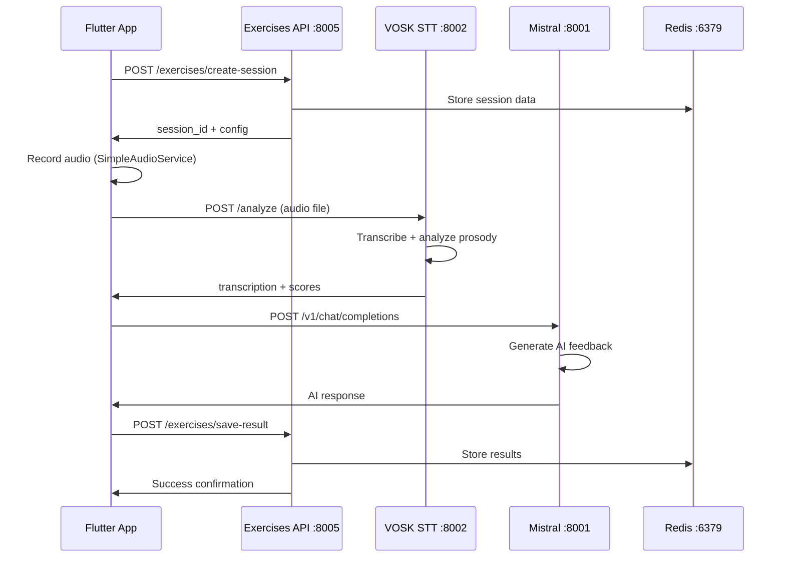
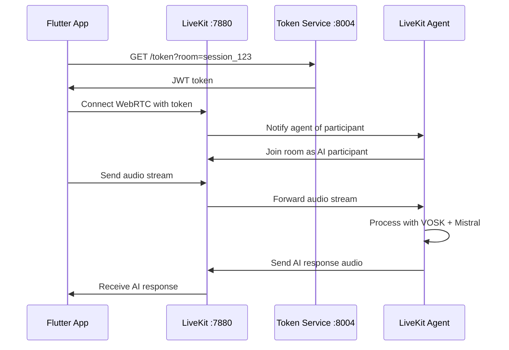

# 🎯 Guide Architecture et Implémentation des Exercices Vocaux Eloquence

## 📋 Table des Matières
1. [Vue d'ensemble de l'Architecture](#vue-densemble-de-larchitecture)
2. [Services et Ports](#services-et-ports)
3. [Flux de Données](#flux-de-données)
4. [Implémentation Flutter](#implémentation-flutter)
5. [APIs et Endpoints](#apis-et-endpoints)
6. [Configuration et Déploiement](#configuration-et-déploiement)
7. [Exemples d'Utilisation](#exemples-dutilisation)
8. [Troubleshooting](#troubleshooting)

---

## 🏗️ Vue d'ensemble de l'Architecture

### Architecture Microservices
```
┌─────────────────┐    ┌─────────────────┐    ┌─────────────────┐
│   Flutter App   │    │   React Web     │    │  Mobile Apps    │
│   (Port 3000)   │    │   (Port 3001)   │    │   (Native)      │
└─────────┬───────┘    └─────────┬───────┘    └─────────┬───────┘
          │                      │                      │
          └──────────────────────┼──────────────────────┘
                                 │
                    ┌─────────────▼─────────────┐
                    │     Load Balancer        │
                    │    (nginx/traefik)       │
                    └─────────────┬─────────────┘
                                  │
      ┌───────────────────────────┼───────────────────────────┐
      │                           │                           │
┌─────▼─────┐              ┌─────▼─────┐              ┌─────▼─────┐
│ API Layer │              │ Real-time │              │ Analysis  │
│ (REST)    │              │ (WebRTC)  │              │ (AI/ML)   │
└───────────┘              └───────────┘              └───────────┘
```

### Stack Technologique
- **Frontend**: Flutter (Mobile) + React (Web)
- **Backend**: FastAPI (Python) + Flask (Python)
- **Real-time**: LiveKit (WebRTC)
- **AI/ML**: VOSK (STT) + Mistral (LLM)
- **Base de données**: Redis (Cache) + PostgreSQL
- **Orchestration**: Docker Compose

---

## 🔌 Services et Ports

### 📊 Tableau des Services

| Service | Port | Type | Description | URL Interne | URL Externe |
|---------|------|------|-------------|-------------|-------------|
| **Redis** | 6379 | Cache | Sessions, cache | `redis://redis:6379` | `redis://192.168.1.44:6379` |
| **VOSK STT** | 8002 | STT | Reconnaissance vocale | `http://vosk-stt:8002` | `http://192.168.1.44:8002` |
| **Mistral Conversation** | 8001 | LLM | IA conversationnelle | `http://mistral-conversation:8001` | `http://192.168.1.44:8001` |
| **LiveKit Server** | 7880/7881 | WebRTC | Communication temps réel | `ws://livekit-server:7880` | `ws://192.168.1.44:7880` |
| **LiveKit Token Service** | 8004 | Auth | Génération tokens | `http://livekit-token-service:8004` | `http://192.168.1.44:8004` |
| **Eloquence Exercises API** | 8005 | REST | API exercices | `http://eloquence-exercises-api:8005` | `http://192.168.1.44:8005` |
| **API Backend (Flask)** | 8000 | REST | Backend principal | `http://api-backend:8000` | `http://192.168.1.44:8000` |

### 🔧 Configuration des Ports

#### Ports UDP LiveKit (RTC Traffic)
```yaml
ports:
  - "40000-40100:40000-40100/udp"  # Plage ports WebRTC
```

#### Variables d'environnement
```bash
# Configuration réseau
LIVEKIT_URL=ws://192.168.1.44:7880
VOSK_SERVICE_URL=http://192.168.1.44:8002
MISTRAL_BASE_URL=http://192.168.1.44:8001
EXERCISES_API_URL=http://192.168.1.44:8005

# Authentification
LIVEKIT_API_KEY=devkey
LIVEKIT_API_SECRET=devsecret123456789abcdef0123456789abcdef
```

---

## 🔄 Flux de Données

### 1. Flux Exercice Vocal Complet



### 2. Flux LiveKit (Mode Temps Réel)



---

## 📱 Implémentation Flutter

### Configuration de Base

#### 1. AppConfig (lib/core/config/app_config.dart)
```dart
class AppConfig {
  // IP machine hôte pour développement
  static const String devIp = '192.168.1.44';
  
  // Services URLs
  static String get exercisesApiUrl => 
    kDebugMode ? 'http://$devIp:8005' : 'https://exercises.eloquence.app';
    
  static String get voskServiceUrl => 
    kDebugMode ? 'http://$devIp:8002' : 'https://vosk.eloquence.app';
    
  static String get mistralBaseUrl => 
    kDebugMode ? 'http://$devIp:8001' : 'https://mistral.eloquence.app';
    
  static String get livekitUrl => 
    kDebugMode ? 'ws://$devIp:7880' : 'wss://livekit.eloquence.app';
}
```

#### 2. Service Audio Principal
```dart
// lib/features/confidence_boost/data/services/simple_audio_service.dart
class SimpleAudioService {
  static const String VOSK_ENDPOINT = '/analyze';
  static const String MISTRAL_ENDPOINT = '/v1/chat/completions';
  
  Future<AnalysisResult> analyzeAudio(File audioFile) async {
    // 1. Envoyer à VOSK pour transcription
    final voskResponse = await _sendToVosk(audioFile);
    
    // 2. Envoyer à Mistral pour feedback IA
    final aiResponse = await _sendToMistral(voskResponse.transcription);
    
    return AnalysisResult(
      transcription: voskResponse.transcription,
      scores: voskResponse.scores,
      aiResponse: aiResponse,
    );
  }
}
```

### Services d'Exercices

#### 1. UniversalExerciseService
```dart
// lib/features/confidence_boost/data/services/universal_audio_exercise_service.dart
class UniversalExerciseService {
  final String baseUrl = AppConfig.exercisesApiUrl;
  
  // Créer session d'exercice
  Future<ExerciseSession> createSession({
    required String exerciseType,
    required String userId,
  }) async {
    final response = await http.post(
      Uri.parse('$baseUrl/exercises/create-session'),
      headers: {'Content-Type': 'application/json'},
      body: jsonEncode({
        'user_id': userId,
        'exercise_type': exerciseType,
        'language': 'fr',
      }),
    );
    return ExerciseSession.fromJson(response.data);
  }
  
  // Analyser enregistrement
  Future<ExerciseResult> analyzeRecording({
    required File audioFile,
    required String sessionId,
  }) async {
    final request = http.MultipartRequest(
      'POST',
      Uri.parse('$baseUrl/exercises/analyze'),
    );
    
    request.fields['session_id'] = sessionId;
    request.files.add(
      await http.MultipartFile.fromPath('audio', audioFile.path),
    );
    
    final response = await request.send();
    return ExerciseResult.fromJson(await response.stream.bytesToString());
  }
}
```

#### 2. Providers d'État
```dart
// lib/features/confidence_boost/presentation/providers/universal_exercise_provider.dart
class UniversalExerciseProvider extends ChangeNotifier {
  final UniversalExerciseService _service = UniversalExerciseService();
  
  ExerciseSession? _currentSession;
  ExerciseResult? _lastResult;
  bool _isRecording = false;
  bool _isAnalyzing = false;
  
  // Getters
  ExerciseSession? get currentSession => _currentSession;
  bool get isRecording => _isRecording;
  bool get isAnalyzing => _isAnalyzing;
  
  // Actions
  Future<void> startExerciseSession(String exerciseType) async {
    _currentSession = await _service.createSession(
      exerciseType: exerciseType,
      userId: 'user_123', // À remplacer par l'ID utilisateur réel
    );
    notifyListeners();
  }
  
  Future<void> analyzeAudio(File audioFile) async {
    if (_currentSession == null) return;
    
    _isAnalyzing = true;
    notifyListeners();
    
    try {
      _lastResult = await _service.analyzeRecording(
        audioFile: audioFile,
        sessionId: _currentSession!.id,
      );
    } finally {
      _isAnalyzing = false;
      notifyListeners();
    }
  }
}
```

---

## 🌐 APIs et Endpoints

### 1. Eloquence Exercises API (Port 8005)

#### Endpoints Principaux
```http
# Créer session d'exercice
POST /exercises/create-session
Content-Type: application/json
{
  "user_id": "user_123",
  "exercise_type": "virelangue",
  "language": "fr",
  "difficulty": "intermediate"
}

# Analyser enregistrement
POST /exercises/analyze
Content-Type: multipart/form-data
- audio: File (WAV/MP3)
- session_id: String
- metadata: JSON (optional)

# Obtenir résultats
GET /exercises/results/{session_id}

# Lister exercices disponibles
GET /exercises/available?language=fr&category=virelangue
```

### 2. VOSK STT Service (Port 8002)

#### Endpoints
```http
# Analyse complète (transcription + prosodie)
POST /analyze
Content-Type: multipart/form-data
- audio: File
- scenario_type: String (optional)
- scenario_context: String (optional)

# Transcription simple
POST /transcribe
Content-Type: multipart/form-data
- audio: File

# Santé du service
GET /health
```

#### Réponse d'Analyse
```json
{
  "transcription": {
    "text": "Bonjour, comment allez-vous ?",
    "confidence": 0.85,
    "words": [
      {"word": "Bonjour", "start": 0.0, "end": 0.5, "conf": 0.9},
      {"word": "comment", "start": 0.6, "end": 1.0, "conf": 0.8}
    ],
    "duration": 2.5,
    "language": "fr"
  },
  "prosody": {
    "pitch_mean": 180.5,
    "pitch_std": 25.3,
    "energy_mean": 0.45,
    "speaking_rate": 145.0,
    "pause_ratio": 0.15,
    "voice_quality": 0.78
  },
  "confidence_score": 0.85,
  "fluency_score": 0.82,
  "clarity_score": 0.78,
  "energy_score": 0.71,
  "overall_score": 79.2,
  "processing_time": 1.23,
  "strengths": ["Excellente articulation", "Débit naturel"],
  "improvements": ["Varier l'intonation", "Réduire les pauses"],
  "feedback": "Bonne performance ! Continuez à travailler l'expressivité."
}
```

### 3. Mistral Conversation (Port 8001)

#### Endpoint Principal
```http
POST /v1/chat/completions
Content-Type: application/json
{
  "model": "mistral-nemo-instruct-2407",
  "messages": [
    {
      "role": "system",
      "content": "Tu es Marie, coach vocal pour exercices de confiance..."
    },
    {
      "role": "user", 
      "content": "Analyse ma performance: [transcription]"
    }
  ],
  "temperature": 0.7,
  "max_tokens": 200
}
```

### 4. LiveKit Token Service (Port 8004)

#### Endpoints
```http
# Générer token pour room
GET /token?room={room_name}&identity={user_id}

# Santé du service
GET /health
```

---

## ⚙️ Configuration et Déploiement

### 1. Docker Compose Principal
```yaml
# docker-compose.yml
version: '3.8'

services:
  redis:
    image: redis:7-alpine
    ports: ["6379:6379"]
    
  vosk-stt:
    build: ./services/vosk-stt-analysis
    ports: ["8002:8002"]
    volumes:
      - vosk-models:/app/models
      
  mistral-conversation:
    build: ./services/mistral-conversation
    ports: ["8001:8001"]
    environment:
      - MISTRAL_API_KEY=${MISTRAL_API_KEY}
      
  livekit-server:
    image: livekit/livekit-server:latest
    ports: 
      - "7880:7880"
      - "7881:7881"
      - "40000-40100:40000-40100/udp"
    environment:
      - LIVEKIT_KEYS=devkey: devsecret123456789abcdef0123456789abcdef
      
  eloquence-exercises-api:
    build: ./services/eloquence-exercises-api
    ports: ["8005:8005"]
    depends_on: [redis, vosk-stt, mistral-conversation]
```

### 2. Variables d'Environnement (.env)
```bash
# Configuration réseau
HOST_IP=192.168.1.44

# APIs externes
MISTRAL_API_KEY=your_mistral_api_key
SCALEWAY_MISTRAL_URL=https://api.scaleway.ai/xxx/v1

# LiveKit
LIVEKIT_API_KEY=devkey
LIVEKIT_API_SECRET=devsecret123456789abcdef0123456789abcdef
LIVEKIT_URL=ws://192.168.1.44:7880

# Base de données
REDIS_URL=redis://192.168.1.44:6379/0
```

### 3. Commandes de Déploiement
```bash
# Lancer tous les services
docker-compose up -d

# Lancer services spécifiques
docker-compose up -d redis vosk-stt mistral-conversation

# Voir les logs
docker-compose logs -f vosk-stt

# Redémarrer un service
docker-compose restart eloquence-exercises-api

# Arrêter tous les services
docker-compose down
```

---

## 💡 Exemples d'Utilisation

### 1. Exercice de Virelangue Simple

#### Flutter Code
```dart
class VirelangueExerciseScreen extends StatefulWidget {
  @override
  _VirelangueExerciseScreenState createState() => _VirelangueExerciseScreenState();
}

class _VirelangueExerciseScreenState extends State<VirelangueExerciseScreen> {
  final _exerciseProvider = UniversalExerciseProvider();
  final _audioService = SimpleAudioService();
  
  String currentVirelangue = "Un chasseur sachant chasser doit savoir chasser sans son chien";
  
  Future<void> _startExercise() async {
    await _exerciseProvider.startExerciseSession('virelangue');
  }
  
  Future<void> _recordAndAnalyze() async {
    // 1. Enregistrer audio
    final audioFile = await _audioService.startRecording();
    await Future.delayed(Duration(seconds: 5)); // Temps d'enregistrement
    await _audioService.stopRecording();
    
    // 2. Analyser avec VOSK + Mistral
    await _exerciseProvider.analyzeAudio(audioFile);
    
    // 3. Afficher résultats
    _showResults();
  }
  
  void _showResults() {
    final result = _exerciseProvider.lastResult;
    showDialog(
      context: context,
      builder: (context) => ResultDialog(
        transcription: result.transcription,
        scores: result.scores,
        feedback: result.aiResponse,
      ),
    );
  }
}
```

### 2. Appel API Direct

#### Analyse avec VOSK
```dart
class VoskApiService {
  static const String baseUrl = 'http://192.168.1.44:8002';
  
  Future<AnalysisResult> analyzeAudio(File audioFile) async {
    final request = http.MultipartRequest(
      'POST',
      Uri.parse('$baseUrl/analyze'),
    );
    
    request.files.add(
      await http.MultipartFile.fromPath('audio', audioFile.path),
    );
    
    request.fields['scenario_type'] = 'virelangue';
    
    final response = await request.send();
    final responseBody = await response.stream.bytesToString();
    
    return AnalysisResult.fromJson(jsonDecode(responseBody));
  }
}
```

#### Interaction avec Mistral
```dart
class MistralApiService {
  static const String baseUrl = 'http://192.168.1.44:8001';
  
  Future<String> generateFeedback(String transcription) async {
    final response = await http.post(
      Uri.parse('$baseUrl/v1/chat/completions'),
      headers: {'Content-Type': 'application/json'},
      body: jsonEncode({
        'model': 'mistral-nemo-instruct-2407',
        'messages': [
          {
            'role': 'system',
            'content': 'Tu es Marie, coach vocal expert...'
          },
          {
            'role': 'user',
            'content': 'Analyse cette performance: $transcription'
          }
        ],
        'temperature': 0.7,
        'max_tokens': 200,
      }),
    );
    
    final data = jsonDecode(response.body);
    return data['choices'][0]['message']['content'];
  }
}
```

---

## 🔍 Troubleshooting

### Problèmes Courants

#### 1. Erreur de Connexion aux Services
```bash
# Vérifier l'état des services
docker-compose ps

# Vérifier les logs
docker-compose logs vosk-stt

# Tester la connectivité
curl http://192.168.1.44:8002/health
curl http://192.168.1.44:8001/health
```

#### 2. Problème d'Enregistrement Audio Flutter
```dart
// Diagnostic dans SimpleAudioService
Future<bool> _testRealMicrophoneAccess() async {
  // Code de diagnostic existant...
}
```

#### 3. Erreurs VOSK
```bash
# Vérifier le modèle VOSK
docker exec -it eloquence-vosk-stt-1 ls -la /app/models/

# Relancer le téléchargement du modèle
docker exec -it eloquence-vosk-stt-1 /app/download_model.sh
```

#### 4. Problèmes LiveKit
```bash
# Vérifier les tokens
curl "http://192.168.1.44:8004/token?room=test&identity=user123"

# Tester la connexion WebRTC
# Utiliser chrome://webrtc-internals/
```

### Commandes de Diagnostic

#### Vérification des Ports
```bash
# Vérifier les ports occupés
netstat -tulpn | grep :8002
netstat -tulpn | grep :8001
netstat -tulpn | grep :7880

# Tester connectivité réseau
telnet 192.168.1.44 8002
telnet 192.168.1.44 8001
```

#### Tests d'API
```bash
# Test VOSK
curl -X POST http://192.168.1.44:8002/health

# Test Mistral  
curl -X GET http://192.168.1.44:8001/health

# Test Exercises API
curl -X GET http://192.168.1.44:8005/health
```

---

## 📚 Ressources Supplémentaires

### Documentation API
- **VOSK**: Documentation complète dans `services/vosk-stt-analysis/`
- **Mistral**: Configuration dans `services/mistral-conversation/`
- **LiveKit**: Documentation officielle à https://docs.livekit.io/

### Exemples de Code
- **Flutter Examples**: `frontend/flutter_app/lib/features/confidence_boost/examples/`
- **Tests d'Intégration**: `frontend/flutter_app/test/features/confidence_boost/`

### Guides de Configuration
- **Résolution Audio**: `frontend/flutter_app/GUIDE_RESOLUTION_AUDIO_FINAL_REALISTE.md`
- **Configuration LiveKit**: `frontend/flutter_app/docs/GUIDE_RESOLUTION_LIVEKIT.md`

---

## 🎯 Résumé des Points Clés

### Ports et Services Essentiels
- **8002**: VOSK STT (Reconnaissance vocale)
- **8001**: Mistral (IA conversationnelle)
- **8005**: Eloquence Exercises API (Gestion exercices)
- **7880**: LiveKit (Communication temps réel)
- **6379**: Redis (Cache et sessions)

### Flux Principal
1. **Flutter** enregistre audio avec `SimpleAudioService`
2. **VOSK** (8002) transcrit et analyse la prosodie
3. **Mistral** (8001) génère feedback IA personnalisé
4. **Exercises API** (8005) gère sessions et résultats
5. **Redis** (6379) stocke cache et données session

### Configuration Réseau
- **IP de développement**: `192.168.1.44`
- **Configuration Docker**: Services exposés sur toutes interfaces
- **Flutter**: URLs configurées automatiquement selon l'environnement

Ce guide fournit une architecture complète et opérationnelle pour l'implémentation des exercices vocaux dans Eloquence.