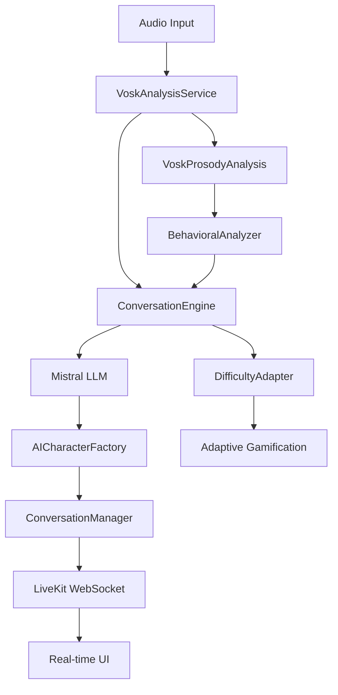

# Documentation Pipeline Conversationnel VOSK + Mistral

## Vue d'ensemble de l'Architecture

Le pipeline conversationnel Eloquence utilise une architecture hybride combinant **VOSK** pour l'analyse vocale en temps réel et **Mistral** pour la génération de réponses conversationnelles intelligentes. Ce pipeline remplace complètement l'ancienne architecture basée sur Whisper.

### Composants Principaux



## 1. VoskAnalysisService

### Responsabilités
- **Transcription en temps réel** : Conversion audio vers texte avec VOSK
- **Analyse prosodique** : Extraction des caractéristiques vocales (débit, pauses, intonation)
- **Gestion des erreurs** : Fallback robuste et timeout optimisé mobile

### API Principale
```dart
class VoskAnalysisService {
  // Analyse principale avec timeout optimisé mobile (6s)
  Future<AnalysisResult> analyzeSpeech(String audioPath);
  
  // Vérification de santé du service
  Future<bool> checkHealth();
  
  // Conversion des résultats VOSK vers format unifié
  AnalysisResult convertToAnalysisResult(Map<String, dynamic> voskData);
}
```

### Configuration
```dart
// Constants optimisées pour mobile
static const int defaultVoskPort = 8003;
static const Duration voskTimeout = Duration(seconds: 6);
static const String voskUrl = 'http://localhost:8003';
```

### Points Clés d'Optimisation
- **Timeout Mobile** : 6 secondes pour éviter les ANR sur mobile
- **Gestion Mémoire** : Nettoyage automatique des ressources audio
- **Fallback** : Mécanisme de fallback vers analyse simplifiée

## 2. ConversationEngine

### Responsabilités
- **Intégration Mistral** : Communication avec le LLM pour génération de réponses
- **Gestion des Rôles** : Adaptation du comportement selon le scénario de conversation
- **Context Management** : Maintien du contexte conversationnel à travers les tours

### Architecture de Conversation
```dart
class ConversationEngine {
  // Génération de réponse contextuelle
  Future<ConversationResponse> generateResponse(
    String userInput,
    ConversationContext context,
    AICharacter character
  );
  
  // Adaptation du rôle selon le scénario
  void updateCharacterRole(ConversationScenario scenario);
  
  // Maintien du contexte
  void updateContext(String userInput, String aiResponse);
}
```

### Types de Scénarios Supportés
- **Job Interview** : Simulation d'entretien d'embauche
- **Presentation** : Entraînement à la présentation
- **Networking** : Situations de networking professionnel
- **Public Speaking** : Prise de parole en public
- **Customer Service** : Interaction client

## 3. AICharacterFactory

### Responsabilités
- **Création Dynamique** : Génération de personnages IA selon le scénario
- **Personnalisation** : Adaptation des traits de personnalité
- **Cohérence** : Maintien de la cohérence du personnage à travers la conversation

### Génération de Personnages
```dart
class AICharacterFactory {
  // Création basée sur le scénario
  AICharacter createCharacterForScenario(ConversationScenario scenario);
  
  // Personnalisation avancée
  AICharacter customizeCharacter(
    AICharacter base, 
    PersonalityTraits traits,
    DifficultyLevel difficulty
  );
}
```

### Traits de Personnalité Configurables
- **Friendliness** : Niveau d'amabilité (1-10)
- **Formality** : Degré de formalité (casual → professional)
- **Patience** : Tolérance aux erreurs et hésitations
- **Challenging** : Niveau de challenge dans les questions
- **Supportiveness** : Degré d'encouragement

## 4. ConversationManager

### Responsabilités
- **Gestion des Tours** : Orchestration des échanges via LiveKit
- **Synchronisation** : Coordination entre analyse vocale et génération de réponse
- **Gestion d'État** : Maintien de l'état conversationnel

### Flux de Conversation
```dart
class ConversationManager {
  // Démarrage de session
  Future<void> startConversation(ConversationScenario scenario);
  
  // Traitement d'un tour utilisateur
  Future<void> processUserTurn(String audioPath);
  
  // Génération et diffusion de la réponse IA
  Future<void> generateAndDeliverAIResponse();
  
  // Fin de session avec métriques
  Future<ConversationMetrics> endConversation();
}
```

### Métriques Collectées
- **Turn Count** : Nombre de tours de conversation
- **Response Times** : Temps de réponse moyen
- **Engagement Score** : Score d'engagement conversationnel
- **Fluency Metrics** : Fluidité de la conversation
- **Prosody Analysis** : Analyses prosodiques agrégées

## 5. Système de Fallback Multi-Niveaux

### Niveau 1 : Fallback Service
```dart
// Si VOSK échoue, fallback vers analyse simplifiée
if (!await voskService.checkHealth()) {
  return await fallbackAnalysisService.analyzeAudio(audioPath);
}
```

### Niveau 2 : Fallback Réseau
```dart
// Tentative sur URL alternative
try {
  return await voskService.analyzeSpeech(audioPath);
} catch (e) {
  return await voskService.analyzeSpeechWithFallbackUrl(audioPath);
}
```

### Niveau 3 : Fallback Local
```dart
// Analyse locale basique si tous les services échouent
return AnalysisResult.createBasicFallback(
  transcript: "Transcription non disponible",
  confidence: 0.0,
  hasValidData: false
);
```

## 6. Optimisations Performance Mobile

### Timeouts Adaptés
```dart
// Timeouts optimisés pour les contraintes mobile
static const Duration voskTimeout = Duration(seconds: 6);
static const Duration globalTimeout = Duration(seconds: 8);
static const Duration livekitConnectionTimeout = Duration(seconds: 5);
```

### Gestion Mémoire
```dart
class AudioResourceManager {
  // Nettoyage automatique après analyse
  void cleanupAfterAnalysis(String audioPath);
  
  // Limitation de la taille des fichiers audio
  bool validateAudioSize(String audioPath);
  
  // Compression audio si nécessaire
  Future<String> compressAudioIfNeeded(String audioPath);
}
```

### Optimisations Réseau
```dart
class OptimizedHttpService {
  // Connexions persistantes
  final http.Client _persistentClient;
  
  // Pool de connexions
  final ConnectionPool _connectionPool;
  
  // Retry avec backoff exponentiel
  Future<http.Response> postWithRetry(String url, dynamic data);
}
```

## 7. Configuration et Déploiement

### Services Backend Requis
```yaml
services:
  # Service VOSK pour analyse vocale
  vosk-stt-analysis:
    image: vosk-analysis:latest
    ports:
      - "8003:8003"
    environment:
      - MODEL_PATH=/models/vosk-model-fr
  
  # Service Mistral pour conversation
  mistral-conversation:
    image: mistral-conv:latest
    ports:
      - "8002:8002"
    environment:
      - MODEL_NAME=mistral-7b-instruct
  
  # Service d'évaluation hybride
  hybrid-speech-evaluation:
    image: hybrid-eval:latest
    ports:
      - "8001:8001"
```

### Configuration Flutter
```dart
// Configuration des URLs de services
class ServiceConfiguration {
  static const String voskServiceUrl = 'http://localhost:8003';
  static const String mistralServiceUrl = 'http://localhost:8002';
  static const String hybridEvalUrl = 'http://localhost:8001';
  static const String livekitUrl = 'wss://eloquence-livekit.com';
}
```

## 8. Tests et Validation

### Tests Unitaires
- **VoskAnalysisService** : Test d'analyse vocale avec données mockées
- **ConversationEngine** : Test de génération de réponses
- **AICharacterFactory** : Test de création de personnages
- **ConversationManager** : Test d'orchestration des tours

### Tests d'Intégration
- **Pipeline End-to-End** : Test complet du flux conversationnel
- **Performance Validation** : Validation des timeouts et métriques
- **Fallback Testing** : Test des mécanismes de fallback
- **LiveKit Integration** : Test de la connexion temps réel

### Métriques de Performance
```dart
class PerformanceMetrics {
  // Temps de réponse VOSK
  Duration voskAnalysisTime;
  
  // Temps de génération Mistral
  Duration mistralGenerationTime;
  
  // Latence end-to-end
  Duration totalResponseTime;
  
  // Taux de succès
  double successRate;
  
  // Score de qualité conversationnelle
  double conversationQuality;
}
```

## 9. Monitoring et Observabilité

### Logs Structurés
```dart
class ConversationLogger {
  void logConversationStart(String sessionId, ConversationScenario scenario);
  void logUserTurn(String sessionId, AnalysisResult analysis);
  void logAIResponse(String sessionId, ConversationResponse response);
  void logConversationEnd(String sessionId, ConversationMetrics metrics);
}
```

### Métriques Temps Réel
- **Service Health** : État des services VOSK et Mistral
- **Response Times** : Temps de réponse en temps réel
- **Error Rates** : Taux d'erreur par service
- **User Engagement** : Métriques d'engagement utilisateur

## 10. Troubleshooting Guide

### Problèmes Fréquents

#### VOSK Service Unavailable
```bash
# Vérification du service
curl -X GET http://localhost:8003/health

# Redémarrage si nécessaire
docker restart vosk-stt-analysis
```

#### Mistral Timeouts
```dart
// Augmentation du timeout si nécessaire
static const Duration mistralTimeout = Duration(seconds: 10);
```

#### LiveKit Connection Issues
```dart
// Vérification de la connectivité
await livekitService.testConnection();

// Régénération des tokens
await tokenManager.refreshTokens();
```

### Logs de Debug
```dart
// Activation des logs détaillés
Logger.root.level = Level.ALL;
Logger.root.onRecord.listen((record) {
  print('${record.level.name}: ${record.time}: ${record.message}');
});
```

## 11. Évolutions Futures

### Améliorations Prévues
- **Multi-Language Support** : Extension à d'autres langues
- **Advanced Prosody** : Analyse prosodique plus sophistiquée
- **Real-time Feedback** : Feedback en temps réel pendant la conversation
- **Emotion Recognition** : Reconnaissance des émotions dans la voix
- **Adaptive Learning** : Apprentissage adaptatif basé sur les interactions

### Scalabilité
- **Microservices** : Décomposition en microservices indépendants
- **Load Balancing** : Répartition de charge pour les services IA
- **Caching** : Mise en cache des réponses fréquentes
- **CDN Integration** : Distribution des modèles via CDN

---

## Conclusion

Le pipeline conversationnel VOSK + Mistral offre une solution complète et robuste pour les conversations IA en temps réel dans Eloquence. L'architecture modulaire permet une maintenance facile et des évolutions futures, tandis que les optimisations mobile garantissent une expérience utilisateur fluide même sur des appareils contraints.

La migration complète de Whisper vers VOSK apporte des améliorations significatives en termes de performance, de fiabilité et de maintenabilité du système.