# 📋 Documentation Complète du Pipeline Audio Eloquence

## 🎯 Vue d'ensemble

Cette documentation détaille l'architecture complète du pipeline audio de l'application Eloquence, depuis la capture vocale jusqu'à la réponse de l'IA.

## 🏗️ Architecture du Système

```mermaid
graph TD
    A[📱 App Flutter] -->|Audio| B[🎤 Capture Microphone]
    B -->|WebRTC| C[🔗 LiveKit Server]
    C -->|Audio Stream| D[🤖 Agent IA]
    D -->|Audio| E[🗣️ Whisper STT]
    E -->|Texte| F[🧠 LLM Processing]
    F -->|Réponse| G[🔊 Azure TTS]
    G -->|Audio| D
    D -->|WebRTC| C
    C -->|Audio Response| A
```



## 📁 Structure des Services

### 1. Services Docker Actifs

```bash
# Vérification des services
docker ps --format "table {{.Names}}\t{{.Ports}}\t{{.Status}}"

# Services requis :
- livekit-server:7880          # Serveur WebRTC
- whisper-stt:8001            # Reconnaissance vocale
- azure-tts:5002              # Synthèse vocale
- api-backend:8000            # Backend principal
- eloquence-agent:8080        # Agent IA
- redis:6379                  # Cache/Session
```

### 2. Configuration Réseau

```dart
// frontend/flutter_app/lib/core/config/app_config.dart
class AppConfig {
  static const String devServerIP = "192.168.1.44";
  
  // URLs des services
  static String get livekitUrl => "ws://$devServerIP:7880";
  static String get whisperUrl => "http://$devServerIP:8001";
  static String get azureTtsUrl => "http://$devServerIP:5002";
  static String get apiBaseUrl => "http://$devServerIP:8000";
  
  // Configuration ICE pour mobile
  static const List<Map<String, dynamic>> iceServers = [
    {"urls": ["stun:stun.l.google.com:19302"]},
    {"urls": ["stun:stun1.l.google.com:19302"]},
  ];
}
```

## 🔄 Pipeline Audio Détaillé

### Étape 1 : Capture Audio (Flutter)

```dart
// frontend/flutter_app/lib/src/services/clean_livekit_service.dart
class CleanLiveKitService extends ChangeNotifier {
  Room? _room;
  bool _isConnected = false;

  Future<bool> connect(String url, String token) async {
    _logger.i('[DIAGNOSTIC] Tentative de connexion à LiveKit...');
    _logger.i('[DIAGNOSTIC] LiveKit URL: $url');
    
    try {
      final roomOptions = RoomOptions(
        adaptiveStream: true,
        dynacast: true,
        defaultAudioPublishOptions: const AudioPublishOptions(),
      );

      _room = Room(roomOptions: roomOptions);
      _listener = _room!.createListener();
      _setupRemoteTrackListener();

      final connectOptions = ConnectOptions(
        autoSubscribe: true,
        rtcConfiguration: const RTCConfiguration(
          iceServers: [
            RTCIceServer(urls: ['stun:stun.l.google.com:19302']),
            RTCIceServer(urls: ['stun:stun1.l.google.com:19302']),
          ],
        ),
      );

      await _room!.connect(url, token, connectOptions: connectOptions);
      _logger.i('[DIAGNOSTIC] Connexion LiveKit réussie!');
      return true;
    } catch (e, stackTrace) {
      _logger.e('[DIAGNOSTIC] Erreur connexion LiveKit: $e');
      return false;
    }
  }

  Future<void> publishMyAudio() async {
    if (_room?.localParticipant != null) {
      try {
        _logger.i('[DIAGNOSTIC] Activation du microphone...');
        final publication = await _room!.localParticipant!.setMicrophoneEnabled(true);
        
        if (publication != null) {
          _logger.i('[DIAGNOSTIC] Microphone publié - SID: ${publication.sid}');
        }
      } catch (e) {
        _logger.e('[DIAGNOSTIC] Erreur publication microphone: $e');
      }
    }
  }
}
```

### Étape 2 : Serveur LiveKit (WebRTC)

```yaml
# livekit.yaml - Configuration du serveur LiveKit
port: 7880
bind_addresses:
  - ""
rtc:
  tcp_port: 7881
  port_range_start: 50000
  port_range_end: 50019
  use_external_ip: true
  
redis:
  address: redis:6379
  
keys:
  devkey: secret
  
room:
  auto_create: true
  max_participants: 10
  
webhook:
  api_key: devkey
```

### Étape 3 : Agent IA (Traitement Audio)

```python
# services/api-backend/eloquence_agent_v1.py
import asyncio
import logging
from livekit import rtc
from livekit.agents import AutoSubscribe, JobContext, WorkerOptions, cli, llm
from livekit.agents.voice_assistant import VoiceAssistant
from livekit.plugins import openai, azure

logger = logging.getLogger("eloquence-agent")

class EloquenceAgent:
    def __init__(self):
        self.whisper_url = "http://whisper-stt:8001"
        self.tts_url = "http://azure-tts:5002"
        
    async def entrypoint(self, ctx: JobContext):
        logger.info(f"[AGENT] Connexion à la room: {ctx.room.name}")
        
        # Configuration de l'assistant vocal
        assistant = VoiceAssistant(
            vad=rtc.VAD.for_speaking_detection(),
            stt=self._create_stt_service(),
            llm=self._create_llm_service(),
            tts=self._create_tts_service(),
            chat_ctx=llm.ChatContext().append(
                role="system",
                text="Tu es un coach en éloquence. Aide l'utilisateur à améliorer ses compétences de communication."
            ),
        )
        
        # Démarrage de l'assistant
        assistant.start(ctx.room)
        
        # Gestion des événements
        await self._setup_event_handlers(ctx, assistant)
        
    def _create_stt_service(self):
        """Service de reconnaissance vocale Whisper"""
        return WhisperSTTService(self.whisper_url)
        
    def _create_tts_service(self):
        """Service de synthèse vocale Azure"""
        return AzureTTSService(self.tts_url)
        
    async def _setup_event_handlers(self, ctx: JobContext, assistant: VoiceAssistant):
        """Configuration des gestionnaires d'événements"""
        
        @ctx.room.on("participant_connected")
        def on_participant_connected(participant: rtc.RemoteParticipant):
            logger.info(f"[AGENT] Participant connecté: {participant.identity}")
            
        @ctx.room.on("track_subscribed")
        def on_track_subscribed(track: rtc.Track, publication: rtc.TrackPublication, participant: rtc.RemoteParticipant):
            logger.info(f"[AGENT] Track audio reçu de: {participant.identity}")
            if track.kind == rtc.TrackKind.KIND_AUDIO:
                assistant.link_participant(participant.identity)

if __name__ == "__main__":
    cli.run_app(WorkerOptions(entrypoint_fnc=EloquenceAgent().entrypoint))
```

### Étape 4 : Service Whisper STT

```python
# services/whisper-stt/app.py
from fastapi import FastAPI, File, UploadFile, HTTPException
import whisper
import tempfile
import os
import logging

app = FastAPI(title="Whisper STT Service")
logger = logging.getLogger("whisper-stt")

# Chargement du modèle Whisper
model = whisper.load_model("base")

@app.get("/health")
async def health_check():
    return {"status": "ok", "model": "whisper-base"}

@app.post("/v1/audio/transcriptions")
async def transcribe_audio(file: UploadFile = File(...)):
    """Transcription audio avec Whisper"""
    try:
        logger.info(f"[STT] Réception fichier audio: {file.filename}")
        
        # Sauvegarde temporaire
        with tempfile.NamedTemporaryFile(delete=False, suffix=".wav") as temp_file:
            content = await file.read()
            temp_file.write(content)
            temp_path = temp_file.name
        
        # Transcription
        logger.info("[STT] Début transcription...")
        result = model.transcribe(temp_path, language="fr")
        
        # Nettoyage
        os.unlink(temp_path)
        
        transcription = result["text"].strip()
        logger.info(f"[STT] Transcription: {transcription}")
        
        return {
            "text": transcription,
            "language": result.get("language", "fr"),
            "confidence": 0.95  # Whisper ne fournit pas de score de confiance
        }
        
    except Exception as e:
        logger.error(f"[STT] Erreur transcription: {e}")
        raise HTTPException(status_code=500, detail=str(e))

if __name__ == "__main__":
    import uvicorn
    uvicorn.run(app, host="0.0.0.0", port=8001)
```

### Étape 5 : Service Azure TTS

```python
# services/api-backend/services/tts_service_piper.py
from fastapi import FastAPI, HTTPException
from pydantic import BaseModel
import azure.cognitiveservices.speech as speechsdk
import io
import logging

app = FastAPI(title="Azure TTS Service")
logger = logging.getLogger("azure-tts")

class TTSRequest(BaseModel):
    text: str
    voice: str = "fr-FR-DeniseNeural"
    speed: float = 1.0

# Configuration Azure
AZURE_SPEECH_KEY = os.getenv("AZURE_SPEECH_KEY")
AZURE_SPEECH_REGION = os.getenv("AZURE_SPEECH_REGION", "eastus2")

@app.get("/health")
async def health_check():
    return {
        "status": "ok",
        "engine": "azure",
        "azure_available": bool(AZURE_SPEECH_KEY),
        "language": "fr-FR",
        "quality": "high"
    }

@app.post("/v1/audio/speech")
async def synthesize_speech(request: TTSRequest):
    """Synthèse vocale avec Azure TTS"""
    try:
        logger.info(f"[TTS] Synthèse: {request.text[:50]}...")
        
        # Configuration Azure Speech
        speech_config = speechsdk.SpeechConfig(
            subscription=AZURE_SPEECH_KEY,
            region=AZURE_SPEECH_REGION
        )
        speech_config.speech_synthesis_voice_name = request.voice
        
        # Synthèse en mémoire
        synthesizer = speechsdk.SpeechSynthesizer(
            speech_config=speech_config,
            audio_config=None
        )
        
        # SSML pour contrôler la vitesse
        ssml = f"""
        <speak version="1.0" xmlns="http://www.w3.org/2001/10/synthesis" xml:lang="fr-FR">
            <voice name="{request.voice}">
                <prosody rate="{request.speed}">
                    {request.text}
                </prosody>
            </voice>
        </speak>
        """
        
        result = synthesizer.speak_ssml_async(ssml).get()
        
        if result.reason == speechsdk.ResultReason.SynthesizingAudioCompleted:
            logger.info("[TTS] Synthèse réussie")
            return {
                "audio_data": result.audio_data,
                "content_type": "audio/wav"
            }
        else:
            logger.error(f"[TTS] Erreur synthèse: {result.reason}")
            raise HTTPException(status_code=500, detail="Erreur de synthèse")
            
    except Exception as e:
        logger.error(f"[TTS] Erreur: {e}")
        raise HTTPException(status_code=500, detail=str(e))
```

## 🔍 Diagnostic du Pipeline Audio

### Script de Test Complet

```python
# scripts/test_pipeline_audio_complet.py
import asyncio
import aiohttp
import json
import logging
from datetime import datetime

class AudioPipelineTester:
    def __init__(self):
        self.base_ip = "192.168.1.44"
        self.services = {
            "livekit": f"http://{self.base_ip}:7880",
            "whisper": f"http://{self.base_ip}:8001",
            "azure_tts": f"http://{self.base_ip}:5002",
            "api_backend": f"http://{self.base_ip}:8000",
            "agent": f"http://{self.base_ip}:8080"
        }
        
    async def test_all_services(self):
        """Test complet de tous les services"""
        print("=== TEST COMPLET DU PIPELINE AUDIO ===")
        print(f"Timestamp: {datetime.now()}")
        
        results = {}
        
        # Test de chaque service
        for service_name, url in self.services.items():
            print(f"\n[TEST] {service_name.upper()}...")
            results[service_name] = await self.test_service(service_name, url)
        
        # Test du pipeline complet
        print("\n[TEST] PIPELINE COMPLET...")
        results["pipeline"] = await self.test_full_pipeline()
        
        # Rapport final
        self.generate_report(results)
        
    async def test_service(self, service_name, base_url):
        """Test d'un service individuel"""
        try:
            async with aiohttp.ClientSession() as session:
                if service_name == "livekit":
                    # Test WebSocket LiveKit
                    async with session.get(f"{base_url}") as response:
                        if response.status == 200:
                            return {"status": "OK", "details": "LiveKit accessible"}
                        
                elif service_name == "whisper":
                    # Test health endpoint
                    async with session.get(f"{base_url}/health") as response:
                        if response.status == 200:
                            data = await response.json()
                            return {"status": "OK", "details": data}
                            
                elif service_name == "azure_tts":
                    # Test health endpoint
                    async with session.get(f"{base_url}/health") as response:
                        if response.status == 200:
                            data = await response.json()
                            return {"status": "OK", "details": data}
                            
                elif service_name == "api_backend":
                    # Test scenarios endpoint
                    async with session.get(f"{base_url}/api/scenarios?language=fr") as response:
                        if response.status == 200:
                            data = await response.json()
                            return {"status": "OK", "details": f"{data['total']} scénarios"}
                            
                elif service_name == "agent":
                    # Test agent health
                    async with session.get(f"{base_url}/health") as response:
                        if response.status == 200:
                            return {"status": "OK", "details": "Agent accessible"}
                            
        except Exception as e:
            return {"status": "ERROR", "details": str(e)}
            
    async def test_full_pipeline(self):
        """Test du pipeline audio complet"""
        try:
            # 1. Test STT avec un fichier audio de test
            stt_result = await self.test_stt_service()
            
            # 2. Test TTS avec du texte
            tts_result = await self.test_tts_service()
            
            # 3. Test intégration LiveKit
            livekit_result = await self.test_livekit_integration()
            
            return {
                "stt": stt_result,
                "tts": tts_result,
                "livekit": livekit_result
            }
            
        except Exception as e:
            return {"status": "ERROR", "details": str(e)}
            
    async def test_stt_service(self):
        """Test du service STT avec un fichier audio"""
        try:
            # Créer un fichier audio de test (silence de 1 seconde)
            import wave
            import numpy as np
            
            sample_rate = 16000
            duration = 1.0
            samples = np.zeros(int(sample_rate * duration), dtype=np.int16)
            
            with wave.open("test_audio.wav", "w") as wav_file:
                wav_file.setnchannels(1)
                wav_file.setsampwidth(2)
                wav_file.setframerate(sample_rate)
                wav_file.writeframes(samples.tobytes())
            
            # Envoyer au service STT
            async with aiohttp.ClientSession() as session:
                with open("test_audio.wav", "rb") as audio_file:
                    data = aiohttp.FormData()
                    data.add_field('file', audio_file, filename='test.wav')
                    
                    async with session.post(f"{self.services['whisper']}/v1/audio/transcriptions", data=data) as response:
                        if response.status == 200:
                            result = await response.json()
                            return {"status": "OK", "transcription": result.get("text", "")}
                        else:
                            return {"status": "ERROR", "details": f"HTTP {response.status}"}
                            
        except Exception as e:
            return {"status": "ERROR", "details": str(e)}
            
    async def test_tts_service(self):
        """Test du service TTS"""
        try:
            async with aiohttp.ClientSession() as session:
                payload = {
                    "text": "Bonjour, ceci est un test de synthèse vocale.",
                    "voice": "fr-FR-DeniseNeural"
                }
                
                async with session.post(f"{self.services['azure_tts']}/v1/audio/speech", json=payload) as response:
                    if response.status == 200:
                        audio_data = await response.read()
                        return {"status": "OK", "audio_size": len(audio_data)}
                    else:
                        return {"status": "ERROR", "details": f"HTTP {response.status}"}
                        
        except Exception as e:
            return {"status": "ERROR", "details": str(e)}
            
    async def test_livekit_integration(self):
        """Test de l'intégration LiveKit"""
        try:
            # Test de création de token
            import jwt
            import time
            
            token_payload = {
                "iss": "devkey",
                "sub": "test-user",
                "iat": int(time.time()),
                "exp": int(time.time()) + 3600,
                "room": "test-room"
            }
            
            token = jwt.encode(token_payload, "secret", algorithm="HS256")
            
            return {"status": "OK", "token_generated": bool(token)}
            
        except Exception as e:
            return {"status": "ERROR", "details": str(e)}
            
    def generate_report(self, results):
        """Génération du rapport de test"""
        print("\n" + "="*50)
        print("RAPPORT DE TEST DU PIPELINE AUDIO")
        print("="*50)
        
        for service, result in results.items():
            status = result.get("status", "UNKNOWN")
            details = result.get("details", "")
            
            if status == "OK":
                print(f"✅ {service.upper()}: {details}")
            else:
                print(f"❌ {service.upper()}: {details}")
        
        # Recommandations
        print("\n" + "="*50)
        print("RECOMMANDATIONS")
        print("="*50)
        
        failed_services = [name for name, result in results.items() if result.get("status") != "OK"]
        
        if not failed_services:
            print("✅ Tous les services fonctionnent correctement!")
        else:
            print("❌ Services en échec:")
            for service in failed_services:
                print(f"   - {service}")
                
        print("\nPour diagnostiquer les problèmes:")
        print("1. Vérifiez les logs Docker: docker logs <container_name>")
        print("2. Testez la connectivité réseau depuis l'app Flutter")
        print("3. Vérifiez les tokens LiveKit")
        print("4. Contrôlez les permissions microphone sur mobile")

async def main():
    tester = AudioPipelineTester()
    await tester.test_all_services()

if __name__ == "__main__":
    asyncio.run(main())
```

## 🚨 Points de Défaillance Courants

### 1. Problèmes de Token LiveKit

```python
# Génération correcte du token LiveKit
import jwt
import time

def generate_livekit_token(room_name: str, participant_name: str):
    payload = {
        "iss": "devkey",  # Doit correspondre à la clé dans livekit.yaml
        "sub": participant_name,
        "iat": int(time.time()),
        "exp": int(time.time()) + 3600,  # 1 heure
        "room": room_name,
        "grants": {
            "room": room_name,
            "roomJoin": True,
            "canPublish": True,
            "canSubscribe": True
        }
    }
    
    return jwt.encode(payload, "secret", algorithm="HS256")
```

### 2. Configuration Audio Mobile

```dart
// Permissions Android (android/app/src/main/AndroidManifest.xml)
<uses-permission android:name="android.permission.RECORD_AUDIO" />
<uses-permission android:name="android.permission.INTERNET" />
<uses-permission android:name="android.permission.ACCESS_NETWORK_STATE" />
<uses-permission android:name="android.permission.MODIFY_AUDIO_SETTINGS" />

// Configuration iOS (ios/Runner/Info.plist)
<key>NSMicrophoneUsageDescription</key>
<string>Cette app a besoin d'accéder au microphone pour l'entraînement vocal</string>
```

### 3. Logs de Diagnostic

```bash
# Surveillance des logs en temps réel
docker logs -f 25eloquence-finalisation-eloquence-agent-v1-1
docker logs -f 25eloquence-finalisation-livekit-1
docker logs -f 25eloquence-finalisation-whisper-stt-1
docker logs -f 25eloquence-finalisation-azure-tts-1

# Vérification des connexions réseau
netstat -an | grep "7880\|8001\|5002\|8000\|8080"
```

## 🔧 Solutions aux Problèmes Courants

### Problème : L'IA ne répond pas

**Causes possibles :**
1. Agent IA non connecté à LiveKit
2. Token LiveKit invalide
3. Service STT ne transcrit pas
4. Service TTS ne génère pas d'audio
5. Problème de routage audio WebRTC

**Solutions :**
1. Vérifier les logs de l'agent
2. Régénérer le token LiveKit
3. Tester STT individuellement
4. Tester TTS individuellement
5. Vérifier la configuration ICE

### Problème : Audio non capturé

**Solutions :**
1. Vérifier les permissions microphone
2. Tester sur émulateur vs appareil physique
3. Vérifier la configuration WebRTC
4. Contrôler les serveurs STUN

## 📊 Monitoring et Métriques

```python
# Script de monitoring continu
import asyncio
import aiohttp
import time

async def monitor_services():
    services = {
        "LiveKit": "http://192.168.1.44:7880",
        "Whisper": "http://192.168.1.44:8001/health",
        "Azure TTS": "http://192.168.1.44:5002/health",
        "API Backend": "http://192.168.1.44:8000/api/scenarios?language=fr",
        "Agent": "http://192.168.1.44:8080/health"
    }
    
    while True:
        print(f"\n[{time.strftime('%H:%M:%S')}] Status des services:")
        
        for name, url in services.items():
            try:
                async with aiohttp.ClientSession() as session:
                    async with session.get(url, timeout=5) as response:
                        if response.status == 200:
                            print(f"✅ {name}: OK")
                        else:
                            print(f"⚠️ {name}: HTTP {response.status}")
            except Exception as e:
                print(f"❌ {name}: {str(e)[:50]}")
        
        await asyncio.sleep(30)  # Vérification toutes les 30 secondes

if __name__ == "__main__":
    asyncio.run(monitor_services())
```

---

## 📞 Support et Dépannage

Pour diagnostiquer le problème spécifique où l'IA ne répond pas :

1. **Exécutez le script de test complet** : `python scripts/test_pipeline_audio_complet.py`
2. **Vérifiez les logs de l'agent** : `docker logs -f <agent-container>`
3. **Testez chaque service individuellement**
4. **Vérifiez la génération des tokens LiveKit**
5. **Contrôlez les permissions audio sur mobile**

Cette documentation fournit tous les éléments nécessaires pour diagnostiquer et résoudre les problèmes du pipeline audio.