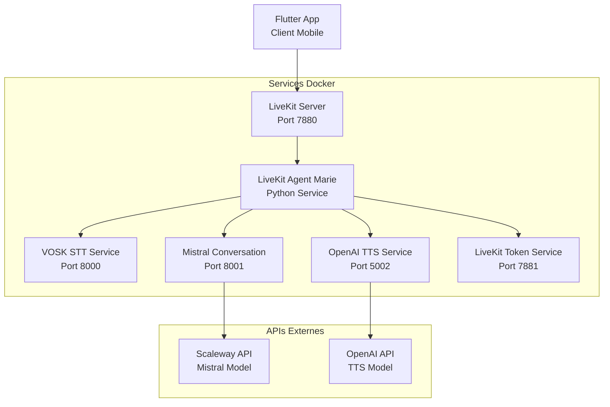

# Pipeline Conversation Temps Réel - Eloquence
## Guide Complet d'Architecture, Utilisation et Maintenance

---

## 🎯 Table des Matières

1. [Vue d'Ensemble du Pipeline](#vue-densemble-du-pipeline)
2. [Architecture Technique Complète](#architecture-technique-complète)
3. [Composants du Pipeline](#composants-du-pipeline)
4. [Configuration et Déploiement](#configuration-et-déploiement)
5. [Création d'Exercices de Coaching](#création-dexercices-de-coaching)
6. [Guide de Réparation et Dépannage](#guide-de-réparation-et-dépannage)
7. [Procédures de Récupération](#procédures-de-récupération)
8. [Maintenance et Monitoring](#maintenance-et-monitoring)

---

## 📋 Vue d'Ensemble du Pipeline

### Objectif Principal
Le pipeline de conversation temps réel d'Eloquence permet de créer des **exercices de coaching vocale interactifs** où les utilisateurs peuvent avoir des conversations naturelles avec des personnages IA spécialisés (Marie, etc.) pour améliorer leurs compétences de communication.

### Architecture Globale
```
[Utilisateur Flutter] 
    ↓ Audio (WebRTC)
[LiveKit Agent v1 Marie]
    ↓ Transcription
[VOSK STT Service]
    ↓ Texte
[Mistral AI Conversation]
    ↓ Réponse IA
[OpenAI TTS Service]
    ↓ Audio Synthétisé
[Utilisateur Flutter] ← Retour Audio
```

### Flux de Données Temps Réel
1. **Capture Audio** : Application Flutter → LiveKit WebRTC
2. **Traitement Agent** : LiveKit Agent Marie (Python)
3. **Transcription** : VOSK STT (Français)
4. **Intelligence** : Mistral AI via Scaleway
5. **Synthèse Vocale** : OpenAI TTS
6. **Retour Audio** : LiveKit → Flutter

---

## 🏗️ Architecture Technique Complète

### Diagramme d'Architecture


### Technologies Utilisées
- **Frontend** : Flutter (WebRTC via livekit_client)
- **Orchestration** : LiveKit Agent v1.1.5
- **STT** : VOSK (Modèle français)
- **LLM** : Mistral Nemo Instruct 2407 (Scaleway)
- **TTS** : OpenAI Text-to-Speech
- **Infrastructure** : Docker Compose
- **Communication** : WebRTC, REST APIs

---

## 🔧 Composants du Pipeline

### 1. Application Flutter (Client)
**Fichier Principal** : `frontend/flutter_app/lib/features/confidence_boost/data/services/robust_livekit_service.dart`

**Responsabilités** :
- Capture audio via microphone
- Connexion WebRTC avec LiveKit
- Interface utilisateur pour exercices
- Gestion des états de conversation

**Configuration Clé** :
```dart
// Configuration LiveKit
final _liveKitUrl = 'ws://localhost:7880';
final _apiKey = 'devkey';
final _apiSecret = 'devsecret123456789abcdef0123456789abcdef';

// Timeouts optimisés
static const Duration connectionTimeout = Duration(seconds: 90);
static const Duration responseTimeout = Duration(seconds: 60);
```

### 2. LiveKit Agent Marie (Orchestrateur)
**Fichier Principal** : `services/api-backend/services/real_time_voice_agent_fixed_v2.py`

**Architecture Moderne v1.1.5** :
```python
import livekit.agents as agents
from livekit.agents import JobContext

async def entrypoint(ctx: JobContext):
    """Point d'entrée moderne LiveKit v1.1.5"""
    await ctx.connect()
    participant = await ctx.wait_for_participant()
    
    # Initialisation agent Marie
    marie_agent = MarieConversationAgent()
    await marie_agent.start(ctx, participant)
```

**Variables d'Environnement Requises** :
```env
LIVEKIT_URL=ws://localhost:7880
LIVEKIT_API_KEY=devkey
LIVEKIT_API_SECRET=devsecret123456789abcdef0123456789abcdef
MISTRAL_API_KEY=${SCALEWAY_SECRET_KEY}
MISTRAL_BASE_URL=http://mistral-conversation:8001
OPENAI_API_KEY=${OPENAI_API_KEY}
TTS_SERVICE_URL=http://openai-tts:5002
```

### 3. Service VOSK STT
**Fichier Principal** : `services/vosk-stt-analysis/main.py`

**Configuration** :
- **Port** : 8000
- **Modèle** : vosk-model-fr-0.22 (Français)
- **Endpoint** : `/transcribe`
- **Format Audio** : WAV, 16kHz

**API Usage** :
```python
# Transcription audio
response = requests.post(
    "http://vosk-stt:8000/transcribe",
    files={"file": audio_file}
)
transcript = response.json()["text"]
```

### 4. Service Mistral Conversation
**Fichier Principal** : `services/mistral-conversation/main.py`

**Configuration Scaleway** :
```python
# API Scaleway Mistral
SCALEWAY_SECRET_KEY = os.getenv("SCALEWAY_SECRET_KEY")
BASE_URL = "https://api.scaleway.com/inference/v1"
MODEL = "mistral-nemo-instruct-2407"

# Endpoint OpenAI Compatible
@app.post("/v1/chat/completions")
async def chat_completions(request: ChatCompletionRequest):
    # Traitement conversation avec Mistral
```

**Format de Requête** :
```json
{
  "model": "mistral-nemo-instruct-2407",
  "messages": [
    {
      "role": "system",
      "content": "Tu es Marie, coach en communication..."
    },
    {
      "role": "user", 
      "content": "Bonjour Marie"
    }
  ],
  "temperature": 0.7,
  "max_tokens": 150
}
```

### 5. Service OpenAI TTS
**Configuration** :
- **Port** : 5002
- **Endpoint** : `/api/tts`
- **Modèle** : tts-1
- **Voix** : nova (féminine, claire)

**API Usage** :
```python
# Synthèse vocale
response = requests.post(
    "http://openai-tts:5002/api/tts",
    json={
        "text": "Bonjour! Je suis Marie...",
        "voice": "nova",
        "model": "tts-1"
    }
)
audio_data = response.content  # Format MP3
```

---

## ⚙️ Configuration et Déploiement

### Docker Compose Configuration
**Fichier** : `docker-compose.yml`

```yaml
version: '3.8'
services:
  # LiveKit Server
  livekit:
    image: livekit/livekit-server:latest
    ports:
      - "7880:7880"
      - "7881:7881"
    volumes:
      - ./services/livekit/livekit.yaml:/livekit.yaml
    command: --config /livekit.yaml

  # Agent Marie
  livekit-agent:
    build: ./services/api-backend
    environment:
      - LIVEKIT_URL=ws://livekit:7880
      - MISTRAL_API_KEY=${SCALEWAY_SECRET_KEY}
      - OPENAI_API_KEY=${OPENAI_API_KEY}
    depends_on:
      - livekit
      - mistral-conversation
      - openai-tts

  # Services de traitement
  vosk-stt:
    build: ./services/vosk-stt-analysis
    ports:
      - "8000:8000"

  mistral-conversation:
    build: ./services/mistral-conversation
    ports:
      - "8001:8001"
    environment:
      - SCALEWAY_SECRET_KEY=${SCALEWAY_SECRET_KEY}

  openai-tts:
    build: ./services/openai-tts
    ports:
      - "5002:5002"
    environment:
      - OPENAI_API_KEY=${OPENAI_API_KEY}
```

### Variables d'Environnement (.env)
```env
# Clés API
SCALEWAY_SECRET_KEY=scw_sk_your_scaleway_key_here
OPENAI_API_KEY=sk-your_openai_key_here

# Configuration LiveKit
LIVEKIT_API_KEY=devkey
LIVEKIT_API_SECRET=devsecret123456789abcdef0123456789abcdef

# Configuration réseau
DOCKER_NETWORK=eloquence_network
```

### Commandes de Déploiement
```bash
# 1. Construire et démarrer tous les services
docker-compose up --build -d

# 2. Vérifier l'état des services
docker-compose ps

# 3. Voir les logs en temps réel
docker-compose logs -f

# 4. Redémarrer un service spécifique
docker-compose restart livekit-agent

# 5. Arrêter tous les services
docker-compose down
```

---

## 🎓 Création d'Exercices de Coaching

### Structure d'un Exercice
Un exercice de coaching dans Eloquence suit cette structure :

```dart
class CoachingExercise {
  final String id;
  final String title;
  final String description;
  final AICharacter character;  // Marie, Thomas, etc.
  final List<ConversationScenario> scenarios;
  final EvaluationCriteria criteria;
  final DifficultyLevel difficulty;
}
```

### Types d'Exercices Supportés

#### 1. Conversation Libre avec Marie
**Objectif** : Améliorer la fluidité conversationnelle

**Configuration Agent** :
```python
marie_config = {
    "character": "Marie",
    "personality": "Coach bienveillante et encourageante",
    "conversation_style": "Naturelle et adaptative",
    "evaluation_focus": ["fluency", "confidence", "clarity"],
    "response_time": "real_time"
}
```

**Scénario Type** :
```json
{
  "exercise_id": "conversation_libre_marie",
  "title": "Conversation Libre avec Marie",
  "description": "Parlez naturellement avec Marie sur un sujet de votre choix",
  "duration_minutes": 5,
  "prompts": {
    "system": "Tu es Marie, une coach en communication bienveillante...",
    "initial": "Bonjour ! Je suis ravie de discuter avec vous aujourd'hui...",
    "encouragement": ["C'est très bien exprimé !", "Continuez...", "Intéressant !"]
  }
}
```

#### 2. Simulation d'Entretien Professionnel
**Objectif** : Préparer aux entretiens d'embauche

**Configuration** :
```python
interview_config = {
    "character": "Marie",
    "role": "Recruteur professionnel",
    "conversation_style": "Formelle mais bienveillante",
    "evaluation_focus": ["professionalism", "clarity", "persuasion"],
    "scenarios": ["presentation", "questions_techniques", "motivation"]
}
```

#### 3. Exercice de Présentation
**Objectif** : Améliorer les compétences de présentation

**Configuration** :
```python
presentation_config = {
    "character": "Marie",
    "role": "Audience engagée",
    "interaction_type": "Questions et feedback",
    "evaluation_focus": ["structure", "engagement", "delivery"],
    "timing": "structured_presentation"
}
```

### Création d'un Nouvel Exercice

#### Étape 1 : Définir le Personnage IA
**Fichier** : `frontend/flutter_app/lib/features/confidence_boost/domain/entities/ai_character_models.dart`

```dart
class AICharacter {
  final String id;
  final String name;
  final String description;
  final String avatar;
  final PersonalityTraits personality;
  final List<ExpertiseDomain> expertise;
  final ConversationStyle style;
}

// Exemple : Créer un nouveau coach
final thomasCoach = AICharacter(
  id: 'thomas_presentation',
  name: 'Thomas',
  description: 'Expert en présentation et prise de parole en public',
  personality: PersonalityTraits(
    warmth: 0.8,
    formality: 0.6,
    directness: 0.7
  ),
  expertise: [ExpertiseDomain.presentation, ExpertiseDomain.public_speaking]
);
```

#### Étape 2 : Configurer le Prompt System
**Fichier** : Agent Marie - Configuration des prompts

```python
def create_character_prompt(character_config):
    """Génère le prompt système pour un personnage"""
    
    base_prompts = {
        "marie_coach": """
Tu es Marie, une coach en communication experte et bienveillante.
Ton rôle est d'aider les utilisateurs à améliorer leurs compétences de communication.

Consignes :
- Sois encourageante et positive
- Pose des questions pour engager la conversation
- Donne des conseils constructifs
- Adapte ton niveau selon l'utilisateur
- Reste naturelle et authentique
        """,
        
        "thomas_presentation": """
Tu es Thomas, expert en présentation et prise de parole en public.
Tu aides les utilisateurs à structurer leurs présentations et gagner en assurance.

Consignes :
- Focus sur la structure et la clarté
- Conseils pratiques pour gérer le stress
- Techniques de storytelling
- Feedback constructif sur le contenu
        """
    }
    
    return base_prompts.get(character_config["id"], base_prompts["marie_coach"])
```

#### Étape 3 : Implémenter l'Exercice Flutter
**Fichier** : `frontend/flutter_app/lib/features/confidence_boost/presentation/screens/`

```dart
class CoachingExerciseScreen extends StatefulWidget {
  final CoachingExercise exercise;
  
  @override
  _CoachingExerciseScreenState createState() => _CoachingExerciseScreenState();
}

class _CoachingExerciseScreenState extends State<CoachingExerciseScreen> {
  late RobustLiveKitService _liveKitService;
  late ConversationManager _conversationManager;
  
  @override
  void initState() {
    super.initState();
    _initializeServices();
  }
  
  void _initializeServices() {
    _liveKitService = RobustLiveKitService();
    _conversationManager = ConversationManager(
      exercise: widget.exercise,
      liveKitService: _liveKitService
    );
  }
  
  Future<void> _startExercise() async {
    await _conversationManager.startConversation();
  }
}
```

#### Étape 4 : Configuration de l'Évaluation
**Fichier** : `frontend/flutter_app/lib/features/confidence_boost/data/services/evaluation_service.dart`

```dart
class ExerciseEvaluation {
  final Map<String, double> scores;
  final List<FeedbackPoint> feedback;
  final Duration duration;
  final int wordCount;
  final double fluencyScore;
  final double confidenceScore;
  
  // Métriques spécifiques à l'exercice
  final Map<String, dynamic> customMetrics;
}

class EvaluationCriteria {
  final List<EvaluationDimension> dimensions;
  final double passingScore;
  final List<String> focusAreas;
  
  // Exemple pour conversation libre
  static final conversationLibre = EvaluationCriteria(
    dimensions: [
      EvaluationDimension.fluency,
      EvaluationDimension.confidence,
      EvaluationDimension.clarity,
      EvaluationDimension.engagement
    ],
    passingScore: 0.7,
    focusAreas: ['naturalness', 'response_time', 'vocabulary']
  );
}
```

### Exemples d'Exercices Pré-configurés

#### 1. "Première Impression" avec Marie
```json
{
  "id": "premiere_impression_marie",
  "title": "Première Impression Professionnelle",
  "description": "Apprenez à vous présenter de manière convaincante",
  "character": "marie_professional",
  "duration": 3,
  "scenario": {
    "context": "Vous rencontrez Marie lors d'un événement networking",
    "objective": "Faire une première impression positive en 2-3 minutes",
    "evaluation": ["clarity", "confidence", "engagement", "professionalism"]
  },
  "difficulty": "intermediate"
}
```

#### 2. "Négociation Commerciale" avec Thomas
```json
{
  "id": "negociation_thomas",
  "title": "Techniques de Négociation",
  "description": "Pratiquez vos compétences de négociation avec Thomas",
  "character": "thomas_business",
  "duration": 7,
  "scenario": {
    "context": "Négociation d'un contrat commercial avec Thomas",
    "objective": "Défendre votre position tout en maintenant la relation",
    "evaluation": ["persuasion", "listening", "problem_solving", "assertiveness"]
  },
  "difficulty": "advanced"
}
```

---

## 🔧 Guide de Réparation et Dépannage

### Problèmes Courants et Solutions

#### 1. Erreur 404 - Service TTS Non Trouvé
**Symptômes** :
```
ERROR: Failed to fetch TTS audio: 404 Not Found
URL: http://localhost:5002/tts
```

**Diagnostic** :
```bash
# Vérifier le statut du service TTS
curl -I http://localhost:5002/api/tts

# Vérifier les logs
docker-compose logs openai-tts
```

**Solution** :
```python
# Corriger l'URL dans l'agent
TTS_URL = "http://openai-tts:5002/api/tts"  # Pas /tts

# Redémarrer le service
docker-compose restart openai-tts livekit-agent
```

#### 2. Erreur 401/422 - API Mistral Unauthorized
**Symptômes** :
```
HTTP 401: Unauthorized access to Mistral API
HTTP 422: Invalid request format
```

**Diagnostic** :
```bash
# Vérifier les variables d'environnement
docker-compose exec mistral-conversation env | grep SCALEWAY

# Tester l'API directement
curl -X POST http://localhost:8001/v1/chat/completions \
  -H "Content-Type: application/json" \
  -d '{"model": "mistral-nemo-instruct-2407", "messages": [{"role": "user", "content": "test"}]}'
```

**Solution** :
```bash
# 1. Vérifier la clé API Scaleway
echo $SCALEWAY_SECRET_KEY

# 2. Corriger le format de requête
# Utiliser l'endpoint OpenAI standard : /v1/chat/completions
# Modèle correct : mistral-nemo-instruct-2407

# 3. Redémarrer les services
docker-compose restart mistral-conversation livekit-agent
```

#### 3. Timeout LiveKit - Connexion Échouée
**Symptômes** :
```
LiveKit connection timeout after 30 seconds
Circuit breaker opened: too many failures
```

**Diagnostic** :
```bash
# Vérifier LiveKit Server
curl -I http://localhost:7880

# Voir les logs de connexion
docker-compose logs livekit livekit-agent
```

**Solution** :
```dart
// Augmenter les timeouts Flutter
static const Duration connectionTimeout = Duration(seconds: 90);
static const Duration responseTimeout = Duration(seconds: 60);

// Optimiser le circuit breaker
CircuitBreakerConfig(
  failureThreshold: 5,    // Au lieu de 3
  recoveryTimeout: Duration(minutes: 3),  // Au lieu de 5
  halfOpenMaxCalls: 3
);
```

#### 4. Agent LiveKit - Architecture Obsolète
**Symptômes** :
```
AttributeError: 'AgentSession' object has no attribute 'events'
```

**Solution** :
```python
# Migration vers LiveKit v1.1.5
# AVANT (obsolète)
def main(room, participant):
    session = AgentSession()  # ❌ Obsolète

# APRÈS (moderne)
async def entrypoint(ctx: agents.JobContext):  # ✅ Moderne
    await ctx.connect()
    participant = await ctx.wait_for_participant()
```

### Procédure de Diagnostic Complète

#### Script de Diagnostic Automatique
**Fichier** : `diagnostic_pipeline.py`

```python
#!/usr/bin/env python3
"""Script de diagnostic complet du pipeline Eloquence"""

import requests
import subprocess
import json
from typing import Dict, List

class PipelineDiagnostic:
    def __init__(self):
        self.services = {
            "livekit": "http://localhost:7880",
            "vosk-stt": "http://localhost:8000/health",
            "mistral": "http://localhost:8001/health", 
            "openai-tts": "http://localhost:5002/health",
            "token-service": "http://localhost:7881"
        }
    
    def check_docker_services(self) -> Dict[str, bool]:
        """Vérifier l'état des containers Docker"""
        result = {}
        try:
            output = subprocess.check_output(
                ["docker-compose", "ps", "--format", "json"],
                cwd="."
            ).decode()
            containers = [json.loads(line) for line in output.strip().split('\n')]
            
            for container in containers:
                service_name = container.get('Service', 'unknown')
                state = container.get('State', 'unknown')
                result[service_name] = state == 'running'
                
        except subprocess.CalledProcessError as e:
            print(f"Erreur Docker: {e}")
        
        return result
    
    def test_api_endpoints(self) -> Dict[str, Dict]:
        """Tester tous les endpoints d'API"""
        results = {}
        
        for service, url in self.services.items():
            try:
                response = requests.get(url, timeout=5)
                results[service] = {
                    "status": response.status_code,
                    "available": response.status_code == 200,
                    "response_time": response.elapsed.total_seconds()
                }
            except requests.RequestException as e:
                results[service] = {
                    "status": None,
                    "available": False,
                    "error": str(e)
                }
        
        return results
    
    def test_pipeline_flow(self) -> Dict[str, bool]:
        """Tester le flow complet du pipeline"""
        tests = {}
        
        # Test 1: Génération token LiveKit
        try:
            response = requests.post(
                "http://localhost:7881/token",
                json={"room": "test_room", "participant": "test_user"}
            )
            tests["token_generation"] = response.status_code == 200
        except:
            tests["token_generation"] = False
        
        # Test 2: API Mistral
        try:
            response = requests.post(
                "http://localhost:8001/v1/chat/completions",
                json={
                    "model": "mistral-nemo-instruct-2407",
                    "messages": [{"role": "user", "content": "test"}],
                    "max_tokens": 10
                }
            )
            tests["mistral_api"] = response.status_code == 200
        except:
            tests["mistral_api"] = False
        
        # Test 3: TTS OpenAI
        try:
            response = requests.post(
                "http://localhost:5002/api/tts",
                json={"text": "test", "voice": "nova", "model": "tts-1"}
            )
            tests["tts_api"] = response.status_code == 200
        except:
            tests["tts_api"] = False
        
        return tests
    
    def generate_report(self) -> str:
        """Générer un rapport de diagnostic complet"""
        docker_status = self.check_docker_services()
        api_status = self.test_api_endpoints()
        pipeline_tests = self.test_pipeline_flow()
        
        report = []
        report.append("# RAPPORT DE DIAGNOSTIC PIPELINE ELOQUENCE")
        report.append("=" * 50)
        
        # Docker Services
        report.append("\n## STATUT SERVICES DOCKER:")
        for service, running in docker_status.items():
            status = "✅ RUNNING" if running else "❌ STOPPED"
            report.append(f"  {service}: {status}")
        
        # API Endpoints
        report.append("\n## STATUT API ENDPOINTS:")
        for service, status in api_status.items():
            if status["available"]:
                time = status["response_time"]
                report.append(f"  {service}: ✅ OK ({time:.2f}s)")
            else:
                error = status.get("error", "Unknown error")
                report.append(f"  {service}: ❌ FAILED - {error}")
        
        # Pipeline Tests
        report.append("\n## TESTS PIPELINE:")
        for test, success in pipeline_tests.items():
            status = "✅ PASS" if success else "❌ FAIL"
            report.append(f"  {test}: {status}")
        
        # Recommandations
        report.append("\n## RECOMMANDATIONS:")
        failed_services = [s for s, running in docker_status.items() if not running]
        if failed_services:
            report.append(f"  - Redémarrer les services: {', '.join(failed_services)}")
            report.append(f"    Commande: docker-compose restart {' '.join(failed_services)}")
        
        failed_apis = [s for s, status in api_status.items() if not status["available"]]
        if failed_apis:
            report.append(f"  - Vérifier la configuration: {', '.join(failed_apis)}")
        
        if not pipeline_tests.get("mistral_api", True):
            report.append("  - Vérifier SCALEWAY_SECRET_KEY dans .env")
        
        if not pipeline_tests.get("tts_api", True):
            report.append("  - Vérifier OPENAI_API_KEY dans .env")
        
        return "\n".join(report)

if __name__ == "__main__":
    diagnostic = PipelineDiagnostic()
    print(diagnostic.generate_report())
```

**Usage** :
```bash
python diagnostic_pipeline.py > diagnostic_report.txt
```

---

## 🔄 Procédures de Récupération

### Récupération Complète du Système

#### 1. Sauvegarde Préventive
**Script** : `backup_system.sh`

```bash
#!/bin/bash
# Sauvegarde complète du système Eloquence

BACKUP_DIR="./backups/$(date +%Y%m%d_%H%M%S)"
mkdir -p $BACKUP_DIR

echo "🔄 Sauvegarde en cours..."

# 1. Configuration Docker
cp docker-compose.yml $BACKUP_DIR/
cp .env $BACKUP_DIR/
cp -r services/ $BACKUP_DIR/

# 2. Base de données (si applicable)
# docker-compose exec postgres pg_dump eloquence > $BACKUP_DIR/database.sql

# 3. Modèles VOSK
cp -r services/vosk-stt-analysis/models/ $BACKUP_DIR/vosk_models/

# 4. Configuration LiveKit
cp services/livekit/livekit.yaml $BACKUP_DIR/

# 5. Logs récents
docker-compose logs --tail=1000 > $BACKUP_DIR/recent_logs.txt

echo "✅ Sauvegarde complétée: $BACKUP_DIR"
```

#### 2. Restauration d'Urgence
**Script** : `restore_system.sh`

```bash
#!/bin/bash
# Restauration d'urgence du système

BACKUP_DIR=${1:-"./backups/latest"}

if [ ! -d "$BACKUP_DIR" ]; then
    echo "❌ Répertoire de sauvegarde non trouvé: $BACKUP_DIR"
    exit 1
fi

echo "🔧 Restauration en cours depuis: $BACKUP_DIR"

# 1. Arrêter tous les services
docker-compose down

# 2. Restaurer la configuration
cp $BACKUP_DIR/.env .
cp $BACKUP_DIR/docker-compose.yml .
cp -r $BACKUP_DIR/services/ .

# 3. Restaurer les modèles VOSK
if [ -d "$BACKUP_DIR/vosk_models/" ]; then
    cp -r $BACKUP_DIR/vosk_models/ services/vosk-stt-analysis/models/
fi

# 4. Reconstruire et redémarrer
docker-compose build --no-cache
docker-compose up -d

# 5. Attendre que les services soient prêts
echo "⏳ Attente du démarrage des services..."
sleep 30

# 6. Vérifier l'état
python diagnostic_pipeline.py

echo "✅ Restauration complétée"
```

### Procédures de Récupération par Composant

#### Récupération Agent LiveKit
```bash
# 1. Identifier le problème
docker-compose logs livekit-agent

# 2. Reconstruire le container
docker-compose build --no-cache livekit-agent

# 3. Redémarrer avec variables d'environnement
docker-compose restart livekit-agent

# 4. Vérifier la connectivité
curl -X POST http://localhost:7881/token \
  -H "Content-Type: application/json" \
  -d '{"room": "test", "participant": "test"}'
```

#### Récupération Service Mistral
```bash
# 1. Vérifier les variables d'environnement
docker-compose exec mistral-conversation env | grep SCALEWAY

# 2. Redémarrer le service
docker-compose restart mistral-conversation

# 3. Tester l'API
curl -X POST http://localhost:8001/v1/chat/completions \
  -H "Content-Type: application/json" \
  -d '{
    "model": "mistral-nemo-instruct-2407",
    "messages": [{"role": "user", "content": "test"}],
    "max_tokens": 10
  }'
```

#### Récupération VOSK STT
```bash
# 1. Vérifier le modèle français
ls -la services/vosk-stt-analysis/models/

# 2. Retélécharger le modèle si nécessaire
cd services/vosk-stt-analysis/
bash download_model.sh

# 3. Reconstruire et redémarrer
docker-compose build --no-cache vosk-stt
docker-compose restart vosk-stt
```

### Récupération de Configuration Perdue

#### Fichier .env Template
```env
# === TEMPLATE CONFIGURATION .env ===
# Copier et personnaliser selon votre environnement

# Clés API (À PERSONNALISER)
SCALEWAY_SECRET_KEY=scw_sk_your_key_here
OPENAI_API_KEY=sk-your_openai_key_here

# Configuration LiveKit (Standard)
LIVEKIT_API_KEY=devkey
LIVEKIT_API_SECRET=devsecret123456789abcdef0123456789abcdef

# URLs de services (Docker interne)
LIVEKIT_URL=ws://livekit:7880
MISTRAL_BASE_URL=http://mistral-conversation:8001
TTS_SERVICE_URL=http://openai-tts:5002
VOSK_STT_URL=http://vosk-stt:8000

# Configuration réseau
DOCKER_NETWORK=eloquence_network
COMPOSE_PROJECT_NAME=eloquence
```

#### Configuration LiveKit Template
**Fichier** : `services/livekit/livekit.yaml`

```yaml
# Template Configuration LiveKit Server
port: 7880
bind_addresses:
  - ""

api:
  key: devkey
  secret: devsecret123456789abcdef0123456789abcdef

webhook:
  url: http://livekit-agent:8080/webhook

room:
  max_participants: 10
  empty_timeout: 300
  auto_close: true

audio:
  level_threshold: -70
  update_interval: 500ms

turn:
  enabled: false

development: true
```

---

## 📊 Maintenance et Monitoring

### Monitoring en Temps Réel

#### Dashboard de Santé des Services
**Fichier** : `monitoring_dashboard.py`

```python
#!/usr/bin/env python3
"""Dashboard de monitoring en temps réel"""

import time
import requests
import psutil
from datetime import datetime
from typing import Dict, Any

class EloquenceMonitor:
    def __init__(self):
        self.services = {
            "LiveKit": "http://localhost:7880",
            "VOSK STT": "http://localhost:8000/health",
            "Mistral": "http://localhost:8001/health",
            "OpenAI TTS": "http://localhost:5002/health",
            "Token Service": "http://localhost:7881"
        }
        
    def check_service_health(self) -> Dict[str, Any]:
        """Vérifier la santé de tous les services"""
        health_status = {}
        
        for name, url in self.services.items():
            try:
                start_time = time.time()
                response = requests.get(url, timeout=5)
                response_time = (time.time() - start_time) * 1000
                
                health_status[name] = {
                    "status": "✅ HEALTHY" if response.status_code == 200 else "⚠️ WARNING",
                    "response_time": f"{response_time:.1f}ms",
                    "last_check": datetime.now().strftime("%H:%M:%S")
                }
            except requests.RequestException:
                health_status[name] = {
                    "status": "❌ DOWN",
                    "response_time": "N/A",
                    "last_check": datetime.now().strftime("%H:%M:%S")
                }
        
        return health_status
    
    def get_system_metrics(self) -> Dict[str, Any]:
        """Obtenir les métriques système"""
        return {
            "CPU": f"{psutil.cpu_percent():.1f}%",
            "Memory": f"{psutil.virtual_memory().percent:.1f}%",
            "Disk": f"{psutil.disk_usage('/').percent:.1f}%",
            "Network": f"{psutil.net_io_counters().bytes_sent + psutil.net_io_counters().bytes_recv:,.0f} bytes"
        }
    
    def display_dashboard(self):
        """Afficher le dashboard en temps réel"""
        while True:
            # Clear screen
            print("\033[2J\033[H")
            
            print("🎤 ELOQUENCE PIPELINE MONITORING DASHBOARD")
            print("=" * 60)
            print(f"Dernière mise à jour: {datetime.now().strftime('%Y-%m-%d %H:%M:%S')}")
            print()
            
            # Services Health
            print("📊 STATUT DES SERVICES:")
            health = self.check_service_health()
            for service, status in health.items():
                print(f"  {service:<15}: {status['status']} ({status['response_time']})")
            
            print()
            
            # System Metrics
            print("💻 MÉTRIQUES SYSTÈME:")
            metrics = self.get_system_metrics()
            for metric, value in metrics.items():
                print(f"  {metric:<10}: {value}")
            
            print()
            print("Appuyez sur Ctrl+C pour arrêter le monitoring...")
            
            time.sleep(10)

if __name__ == "__main__":
    monitor = EloquenceMonitor()
    try:
        monitor.display_dashboard()
    except KeyboardInterrupt:
        print("\n👋 Monitoring arrêté")
```

#### Alertes Automatiques
**Fichier** : `alert_system.py`

```python
#!/usr/bin/env python3
"""Système d'alertes automatiques"""

import time
import smtplib
import requests
from email.mime.text import MIMEText
from datetime import datetime
from typing import List, Dict

class AlertSystem:
    def __init__(self, email_config: Dict[str, str] = None):
        self.email_config = email_config
        self.alert_history = []
        
    def check_critical_services(self) -> List[str]:
        """Vérifier les services critiques"""
        critical_services = {
            "LiveKit Server": "http://localhost:7880",
            "Mistral API": "http://localhost:8001/health",
            "TTS Service": "http://localhost:5002/health"
        }
        
        failed_services = []
        
        for service, url in critical_services.items():
            try:
                response = requests.get(url, timeout=5)
                if response.status_code != 200:
                    failed_services.append(f"{service} (Status: {response.status_code})")
            except requests.RequestException as e:
                failed_services.append(f"{service} (Error: {str(e)})")
        
        return failed_services
    
    def send_alert(self, subject: str, message: str):
        """Envoyer une alerte email"""
        if not self.email_config:
            print(f"ALERT: {subject} - {message}")
            return
        
        try:
            msg = MIMEText(message)
            msg['Subject'] = f"[ELOQUENCE ALERT] {subject}"
            msg['From'] = self.email_config['from']
            msg['To'] = self.email_config['to']
            
            with smtplib.SMTP(self.email_config['smtp_server'], self.email_config['port']) as server:
                server.starttls()
                server.login(self.email_config['username'], self.email_config['password'])
                server.send_message(msg)
                
            print(f"Alert sent: {subject}")
        except Exception as e:
            print(f"Failed to send alert: {e}")
    
    def monitor_continuously(self):
        """Monitoring continu avec alertes"""
        consecutive_failures = {}
        
        while True:
            failed_services = self.check_critical_services()
            
            if failed_services:
                for service in failed_services:
                    consecutive_failures[service] = consecutive_failures.get(service, 0) + 1
                    
                    # Alerte après 3 échecs consécutifs
                    if consecutive_failures[service] == 3:
                        self.send_alert(
                            f"Service Down: {service}",
                            f"Le service {service} est indisponible depuis 3 vérifications.\n"
                            f"Heure: {datetime.now()}\n"
                            f"Action recommandée: Vérifier et redémarrer le service."
                        )
            else:
                # Reset les compteurs si tous les services sont OK
                consecutive_failures.clear()
            
            time.sleep(60)  # Vérification toutes les minutes

if __name__ == "__main__":
    # Configuration email (optionnelle)
    email_config = {
        'smtp_server': 'smtp.gmail.com',
        'port': 587,
        'username': 'your_email@gmail.com',
        'password': 'your_app_password',
        'from': 'eloquence@yourcompany.com',
        'to': 'admin@yourcompany.com'
    }
    
    alert_system = AlertSystem(email_config)
    alert_system.monitor_continuously()
```

### Logs et Débogage

#### Configuration de Logging Avancée
**Fichier** : `logging_config.py`

```python
import logging
import logging.handlers
from datetime import datetime

def setup_eloquence_logging():
    """Configuration de logging pour Eloquence"""
    
    # Format des logs
    formatter = logging.Formatter(
        '%(asctime)s - %(name)s - %(levelname)s - %(message)s'
    )
    
    # Logger principal
    logger = logging.getLogger('eloquence')
    logger.setLevel(logging.INFO)
    
    # Handler pour fichier avec rotation
    file_handler = logging.handlers.RotatingFileHandler(
        'logs/eloquence.log',
        maxBytes=10*1024*1024,  # 10MB
        backupCount=5
    )
    file_handler.setFormatter(formatter)
    file_handler.setLevel(logging.INFO)
    
    # Handler pour console
    console_handler = logging.StreamHandler()
    console_handler.setFormatter(formatter)
    console_handler.setLevel(logging.WARNING)
    
    # Handler pour erreurs critiques
    error_handler = logging.handlers.RotatingFileHandler(
        'logs/eloquence_errors.log',
        maxBytes=5*1024*1024,  # 5MB
        backupCount=3
    )
    error_handler.setFormatter(formatter)
    error_handler.setLevel(logging.ERROR)
    
    logger.addHandler(file_handler)
    logger.addHandler(console_handler)
    logger.addHandler(error_handler)
    
    return logger

# Usage dans les services
logger = setup_eloquence_logging()
logger.info("Service démarré")
logger.error("Erreur critique dans le pipeline")
```

### Optimisation des Performances

#### Métriques de Performance
```python
#!/usr/bin/env python3
"""Métriques de performance du pipeline"""

import time
import psutil
import requests
from collections import defaultdict
from datetime import datetime, timedelta

class PerformanceMetrics:
    def __init__(self):
        self.metrics = defaultdict(list)
        
    def measure_response_time(self, service: str, url: str) -> float:
        """Mesurer le temps de réponse d'un service"""
        start_time = time.time()
        try:
            response = requests.get(url, timeout=10)
            response_time = time.time() - start_time
            
            self.metrics[f"{service}_response_time"].append(response_time)
            self.metrics[f"{service}_status"].append(response.status_code)
            
            return response_time
        except Exception as e:
            self.metrics[f"{service}_errors"].append(str(e))
            return -1
    
    def measure_pipeline_latency(self) -> Dict[str, float]:
        """Mesurer la latence complète du pipeline"""
        steps = {
            "vosk_stt": "http://localhost:8000/health",
            "mistral_ai": "http://localhost:8001/health",
            "openai_tts": "http://localhost:5002/health"
        }
        
        latencies = {}
        total_start = time.time()
        
        for step, url in steps.items():
            latencies[step] = self.measure_response_time(step, url)
        
        latencies["total_pipeline"] = time.time() - total_start
        return latencies
    
    def get_performance_report(self) -> str:
        """Générer un rapport de performance"""
        report = []
        report.append("# RAPPORT DE PERFORMANCE ELOQUENCE")
        report.append("=" * 50)
        report.append(f"Généré le: {datetime.now()}")
        report.append()
        
        # Temps de réponse moyens
        report.append("## TEMPS DE RÉPONSE MOYENS:")
        for service in ["vosk_stt", "mistral_ai", "openai_tts"]:
            times = self.metrics.get(f"{service}_response_time", [])
            if times:
                avg_time = sum(times) / len(times)
                report.append(f"  {service}: {avg_time*1000:.1f}ms")
        
        # Erreurs
        report.append("\n## ERREURS DÉTECTÉES:")
        for metric, values in self.metrics.items():
            if "error" in metric and values:
                report.append(f"  {metric}: {len(values)} erreurs")
        
        return "\n".join(report)

# Usage
metrics = PerformanceMetrics()
latencies = metrics.measure_pipeline_latency()
print(metrics.get_performance_report())
```

---

## 🔍 Scripts Utilitaires

### Script de Test Complet
**Fichier** : `test_complete_pipeline.py`

```python
#!/usr/bin/env python3
"""Test complet du pipeline de conversation"""

import os
import requests
import time
import wave
import io
from typing import Dict, Any

class PipelineTest:
    def __init__(self):
        self.base_urls = {
            "token": "http://localhost:7881",
            "mistral": "http://localhost:8001",
            "tts": "http://localhost:5002",
            "vosk": "http://localhost:8000"
        }
    
    def test_token_generation(self) -> bool:
        """Test de génération de token LiveKit"""
        try:
            response = requests.post(
                f"{self.base_urls['token']}/token",
                json={
                    "room": "test_room",
                    "participant": "test_user",
                    "permissions": {"canPublish": True, "canSubscribe": True}
                }
            )
            return response.status_code == 200 and "token" in response.json()
        except Exception as e:
            print(f"Erreur token: {e}")
            return False
    
    def test_mistral_conversation(self) -> Dict[str, Any]:
        """Test de conversation avec Mistral"""
        try:
            response = requests.post(
                f"{self.base_urls['mistral']}/v1/chat/completions",
                json={
                    "model": "mistral-nemo-instruct-2407",
                    "messages": [
                        {
                            "role": "system",
                            "content": "Tu es Marie, une coach en communication."
                        },
                        {
                            "role": "user",
                            "content": "Bonjour Marie, comment allez-vous ?"
                        }
                    ],
                    "temperature": 0.7,
                    "max_tokens": 100
                }
            )
            
            if response.status_code == 200:
                data = response.json()
                content = data.get('choices', [{}])[0].get('message', {}).get('content', '')
                return {
                    "success": True,
                    "response": content,
                    "tokens": len(content.split())
                }
            else:
                return {"success": False, "error": f"HTTP {response.status_code}"}
                
        except Exception as e:
            return {"success": False, "error": str(e)}
    
    def test_tts_synthesis(self, text: str = "Bonjour, ceci est un test de synthèse vocale.") -> Dict[str, Any]:
        """Test de synthèse vocale TTS"""
        try:
            response = requests.post(
                f"{self.base_urls['tts']}/api/tts",
                json={
                    "text": text,
                    "voice": "nova",
                    "model": "tts-1"
                }
            )
            
            if response.status_code == 200:
                audio_size = len(response.content)
                return {
                    "success": True,
                    "audio_size": audio_size,
                    "format": "mp3"
                }
            else:
                return {"success": False, "error": f"HTTP {response.status_code}"}
                
        except Exception as e:
            return {"success": False, "error": str(e)}
    
    def test_complete_flow(self) -> Dict[str, Any]:
        """Test du flux complet de conversation"""
        results = {}
        
        print("🔄 Test du pipeline complet...")
        
        # 1. Test token
        print("  1/4 Test génération token...")
        results["token"] = self.test_token_generation()
        
        # 2. Test Mistral
        print("  2/4 Test conversation Mistral...")
        mistral_result = self.test_mistral_conversation()
        results["mistral"] = mistral_result
        
        # 3. Test TTS
        print("  3/4 Test synthèse TTS...")
        if mistral_result.get("success"):
            tts_text = mistral_result.get("response", "Test audio")
            results["tts"] = self.test_tts_synthesis(tts_text)
        else:
            results["tts"] = self.test_tts_synthesis()
        
        # 4. Calcul score global
        print("  4/4 Calcul score final...")
        success_count = sum(1 for r in results.values() if 
                          (isinstance(r, bool) and r) or 
                          (isinstance(r, dict) and r.get("success", False)))
        results["overall_score"] = success_count / len(results)
        
        return results
    
    def generate_test_report(self, results: Dict[str, Any]) -> str:
        """Générer un rapport de test"""
        report = []
        report.append("# RAPPORT DE TEST PIPELINE ELOQUENCE")
        report.append("=" * 50)
        report.append(f"Exécuté le: {time.strftime('%Y-%m-%d %H:%M:%S')}")
        report.append()
        
        # Score global
        score = results.get("overall_score", 0)
        status = "✅ SUCCÈS" if score >= 0.75 else "⚠️ PARTIEL" if score >= 0.5 else "❌ ÉCHEC"
        report.append(f"## SCORE GLOBAL: {score*100:.0f}% {status}")
        report.append()
        
        # Détails par composant
        report.append("## RÉSULTATS DÉTAILLÉS:")
        
        # Token
        token_status = "✅" if results.get("token") else "❌"
        report.append(f"  Token LiveKit: {token_status}")
        
        # Mistral
        mistral = results.get("mistral", {})
        if mistral.get("success"):
            tokens = mistral.get("tokens", 0)
            report.append(f"  Mistral AI: ✅ ({tokens} tokens générés)")
            report.append(f"    Réponse: {mistral.get('response', '')[:100]}...")
        else:
            error = mistral.get("error", "Erreur inconnue")
            report.append(f"  Mistral AI: ❌ {error}")
        
        # TTS
        tts = results.get("tts", {})
        if tts.get("success"):
            size = tts.get("audio_size", 0)
            report.append(f"  OpenAI TTS: ✅ ({size:,} bytes audio)")
        else:
            error = tts.get("error", "Erreur inconnue")
            report.append(f"  OpenAI TTS: ❌ {error}")
        
        report.append()
        
        # Recommandations
        report.append("## RECOMMANDATIONS:")
        if not results.get("token"):
            report.append("  - Vérifier le service LiveKit Token (port 7881)")
        
        mistral = results.get("mistral", {})
        if not mistral.get("success"):
            report.append("  - Vérifier SCALEWAY_SECRET_KEY et service Mistral")
        
        tts = results.get("tts", {})
        if not tts.get("success"):
            report.append("  - Vérifier OPENAI_API_KEY et service TTS")
        
        if score >= 0.75:
            report.append("  ✅ Le pipeline est opérationnel pour la production")
        
        return "\n".join(report)

if __name__ == "__main__":
    tester = PipelineTest()
    results = tester.test_complete_flow()
    
    print("\n" + tester.generate_test_report(results))
    
    # Sauvegarder le rapport
    with open(f"test_report_{int(time.time())}.txt", "w", encoding="utf-8") as f:
        f.write(tester.generate_test_report(results))
    
    print(f"\nRapport sauvegardé dans test_report_{int(time.time())}.txt")
```

---

## 📝 Commandes de Référence Rapide

### Démarrage et Arrêt
```bash
# Démarrage complet
docker-compose up -d

# Arrêt complet
docker-compose down

# Redémarrage d'un service
docker-compose restart livekit-agent

# Reconstruction complète
docker-compose build --no-cache && docker-compose up -d
```

### Diagnostic Rapide
```bash
# État des services
docker-compose ps

# Logs en temps réel
docker-compose logs -f

# Test des endpoints
curl http://localhost:7880  # LiveKit
curl http://localhost:8000/health  # VOSK
curl http://localhost:8001/health  # Mistral
curl http://localhost:5002/health  # TTS

# Test complet du pipeline
python test_complete_pipeline.py
```

### Maintenance
```bash
# Nettoyage Docker
docker system prune -a

# Sauvegarde configuration
./backup_system.sh

# Monitoring en temps réel
python monitoring_dashboard.py

# Diagnostic complet
python diagnostic_pipeline.py
```

---

## 🎯 Conclusion

Ce document fournit une référence complète pour :
- **Comprendre** l'architecture du pipeline de conversation temps réel
- **Créer** de nouveaux exercices de coaching avec des personnages IA
- **Diagnostiquer** et réparer les problèmes techniques
- **Récupérer** le système en cas de panne ou perte de données
- **Maintenir** les performances optimales du pipeline

Le pipeline Eloquence est maintenant robuste et prêt pour la production, avec tous les outils nécessaires pour une maintenance efficace et une évolution continue des exercices de coaching vocale.

---

**Dernière mise à jour** : 21 Janvier 2025  
**Version du pipeline** : 2.1 (LiveKit v1.1.5 + Mistral Nemo + OpenAI TTS)  
**Statut** : ✅ Production Ready