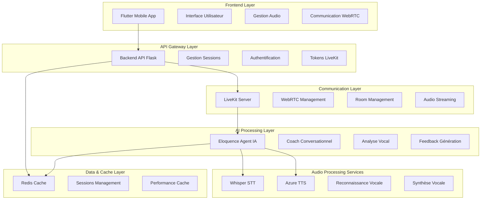
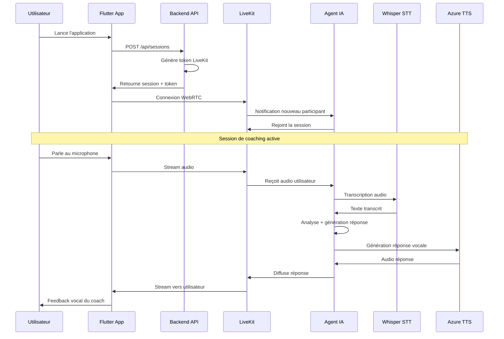

# 🎯 PRÉSENTATION DU PROJET ELOQUENCE

## 📋 VUE D'ENSEMBLE

**Eloquence** est une application innovante de **coaching vocal avec intelligence artificielle conversationnelle** qui révolutionne l'apprentissage de l'art oratoire. Le projet combine des technologies de pointe en traitement du langage naturel, reconnaissance vocale, synthèse vocale et communication temps réel pour offrir une expérience d'apprentissage immersive et personnalisée.

### 🎯 **Objectif Principal**
Créer un coach vocal IA capable d'analyser, corriger et améliorer les compétences de communication orale des utilisateurs en temps réel, accessible via une application mobile Flutter moderne.

### 🏆 **Proposition de Valeur**
- **Coaching personnalisé 24/7** avec un agent IA spécialisé en éloquence
- **Feedback temps réel** sur la diction, le rythme et la clarté
- **Scénarios d'entraînement variés** (présentations, entretiens, discours publics)
- **Interface moderne et intuitive** développée en Flutter
- **Architecture scalable et robuste** basée sur des microservices

---

## 🏗️ ARCHITECTURE TECHNIQUE

### 📐 **Vue d'Ensemble Architecturale**

L'architecture d'Eloquence suit un **pattern microservices** avec une séparation claire des responsabilités, garantissant la scalabilité, la maintenabilité et les performances optimales.



### 🔧 **Composants Principaux**

#### 1. **Frontend Flutter (Port Mobile)**
- **Technologies** : Flutter 3.x, Dart, LiveKit SDK
- **Responsabilités** :
  - Interface utilisateur moderne et responsive
  - Gestion de l'audio en temps réel
  - Communication WebRTC sécurisée
  - Gestion des états et providers
- **Fonctionnalités clés** :
  - Connexion automatique aux sessions de coaching
  - Interface de feedback visuel en temps réel
  - Gestion des permissions audio/micro
  - Navigation fluide entre scénarios

#### 2. **Backend API (Port 8000)**
- **Technologies** : Flask, Python 3.10, SQLAlchemy
- **Responsabilités** :
  - Gestion des sessions de coaching
  - Génération de tokens LiveKit sécurisés
  - API RESTful pour le frontend
  - Coordination des services
- **Endpoints principaux** :
  ```python
  POST /api/sessions          # Création session coaching
  GET  /api/scenarios         # Liste des scénarios disponibles
  POST /api/feedback          # Enregistrement feedback
  GET  /api/analytics         # Statistiques utilisateur
  ```

#### 3. **LiveKit Server (Ports 7880-7881, UDP 50000-60000)**
- **Technologies** : LiveKit v1.9.0, WebRTC
- **Responsabilités** :
  - Gestion des salles de communication temps réel
  - Streaming audio bidirectionnel
  - Gestion des participants (utilisateur + agent IA)
  - Optimisation de la qualité audio
- **Configuration** :
  ```yaml
  port: 7880
  rtc:
    tcp_port: 7881
    port_range_start: 50000
    port_range_end: 60000
    use_external_ip: true
  ```

#### 4. **Agent IA Eloquence (Port 8080)**
- **Technologies** : LiveKit Agents, Mistral AI, Python asyncio
- **Responsabilités** :
  - Coach conversationnel intelligent
  - Analyse des patterns vocaux
  - Génération de feedback personnalisé
  - Adaptation aux styles d'apprentissage
- **Capacités IA** :
  - Compréhension contextuelle des exercices
  - Détection des hésitations et erreurs
  - Suggestions d'amélioration personnalisées
  - Suivi des progrès individuels

#### 5. **Services Audio**

**Whisper STT (Port 8001)**
- **Technologies** : OpenAI Whisper, Faster-Whisper, CUDA
- **Responsabilités** :
  - Transcription vocale haute précision
  - Support multilingue (français prioritaire)
  - Optimisation temps réel
- **Performance** :
  - Latence < 500ms
  - Précision > 95% (français)
  - Support GPU CUDA

**Azure TTS (Port 5002)**
- **Technologies** : Azure Cognitive Services, OpenAI TTS
- **Responsabilités** :
  - Synthèse vocale naturelle
  - Voix française premium
  - Génération audio haute qualité
- **Configuration** :
  - Voix française native
  - Qualité CD (44.1kHz)
  - Faible latence

#### 6. **Cache Redis (Port 6379)**
- **Technologies** : Redis 7-alpine
- **Responsabilités** :
  - Cache des sessions actives
  - Stockage temporaire des métadonnées
  - Optimisation des performances
  - Gestion des états distribués

---

## 🔄 FLUX DE FONCTIONNEMENT

### 📱 **Parcours Utilisateur Complet**



### 🎯 **Scénarios de Coaching Disponibles**

1. **Présentation Professionnelle**
   - Simulation d'entretiens d'embauche
   - Présentations commerciales
   - Pitches d'entreprise

2. **Prise de Parole en Public**
   - Discours formels
   - Conférences
   - Animations de réunions

3. **Communication Interpersonnelle**
   - Négociations
   - Résolution de conflits
   - Leadership vocal

4. **Perfectionnement Technique**
   - Diction et articulation
   - Rythme et intonation
   - Gestion du stress vocal

---

## 🛠️ TECHNOLOGIES ET OUTILS

### 🖥️ **Stack Technique**

#### **Frontend**
- **Flutter 3.x** - Framework mobile cross-platform
- **Dart** - Langage de programmation
- **LiveKit Flutter SDK** - Communication temps réel
- **Provider Pattern** - Gestion d'état
- **Material Design 3** - Interface utilisateur

#### **Backend**
- **Python 3.10** - Langage serveur
- **Flask** - Framework web léger
- **SQLAlchemy** - ORM base de données
- **Celery** - Traitement asynchrone
- **Gunicorn** - Serveur WSGI

#### **Intelligence Artificielle**
- **Mistral AI** - Modèle conversationnel français
- **OpenAI Whisper** - Reconnaissance vocale
- **Azure Cognitive Services** - Synthèse vocale
- **LiveKit Agents** - Framework agent IA

#### **Infrastructure**
- **Docker & Docker Compose** - Containerisation
- **Redis** - Cache et message broker
- **LiveKit** - Serveur WebRTC
- **GitHub Actions** - CI/CD

### 📊 **Métriques de Performance**

#### **Latence Audio**
- STT (Whisper) : < 500ms
- Traitement IA : < 1s
- TTS (Azure) : < 300ms
- **Latence totale** : < 2s

#### **Qualité Audio**
- Fréquence d'échantillonnage : 44.1kHz
- Résolution : 16-bit
- Codec : Opus (WebRTC)
- Suppression bruit : Activée

#### **Scalabilité**
- Sessions simultanées : 100+
- Utilisateurs concurrent : 500+
- Temps de réponse API : < 200ms

---

## 🚀 DÉPLOIEMENT ET ENVIRONNEMENTS

### 🐳 **Architecture Docker**

```yaml
# Structure des conteneurs
eloquence-network:
  - redis (Cache & Sessions)
  - livekit (Communication WebRTC)
  - api-backend (API REST Flask)
  - whisper-stt (Reconnaissance vocale)
  - azure-tts (Synthèse vocale)
  - eloquence-agent-v1 (Agent IA Coach)
```

### 🔧 **Configuration des Services**

#### **Variables d'Environnement Clés**
```bash
# LiveKit Configuration
LIVEKIT_URL=ws://livekit:7880
LIVEKIT_API_KEY=devkey
LIVEKIT_API_SECRET=livekit_secret_key_32_characters_long_for_security_2025

# Services Audio
WHISPER_STT_URL=http://whisper-stt:8001
AZURE_TTS_URL=http://azure-tts:5002

# Intelligence Artificielle
MISTRAL_API_KEY=your_mistral_api_key_here
MISTRAL_BASE_URL=https://api.scaleway.ai/.../v1/chat/completions
MISTRAL_MODEL=mistral-nemo-instruct-2407
```

### 📱 **Déploiement Mobile**

#### **Android**
```bash
flutter build apk --release
flutter build appbundle --release
```

#### **iOS**
```bash
flutter build ios --release
flutter build ipa --release
```

---

## 🧪 STRATÉGIE DE TESTS

### 🔍 **Types de Tests Implémentés**

#### **Tests Unitaires**
- Tests des services Flutter
- Tests des API endpoints
- Tests des composants IA
- Couverture > 80%

#### **Tests d'Intégration**
- Pipeline complet STT → IA → TTS
- Communication WebRTC
- Persistance des sessions
- Performance end-to-end

#### **Tests End-to-End**
- Parcours utilisateur complets
- Tests sur appareils réels
- Simulation de conditions réseau variées
- Tests de charge et stress

### 📊 **Outils de Tests**
```bash
# Flutter
flutter test                    # Tests unitaires
flutter integration_test        # Tests E2E
flutter drive                   # Tests automatisés

# Backend Python
pytest tests/ -v --cov=.        # Tests avec couverture
python -m pytest tests/integration/

# Tests Docker
docker-compose -f docker-compose.test.yml up
```

---

## 📈 ROADMAP ET ÉVOLUTIONS

### 🎯 **Phase Actuelle (Q2 2025)**
- ✅ Architecture microservices opérationnelle
- ✅ Agent IA conversationnel fonctionnel
- ✅ Pipeline audio temps réel stable
- ✅ Interface Flutter moderne
- 🔄 Optimisation des performances
- 🔄 Tests end-to-end complets

### 🚀 **Prochaines Phases**

#### **Phase 2 (Q3 2025) - Enrichissement Fonctionnel**
- Analyse émotionnelle vocale
- Détection du stress dans la voix
- Personnalisation avancée des exercices
- Tableau de bord analytics

#### **Phase 3 (Q4 2025) - Intelligence Augmentée**
- Vision par ordinateur (analyse gestuelle)
- Reconnaissance des expressions faciales
- Coaching multimodal (vocal + visuel)
- IA prédictive des besoins d'amélioration

#### **Phase 4 (2026) - Écosystème Complet**
- Mode multijoueur (sessions de groupe)
- Intégration réalité virtuelle/augmentée
- API publique pour développeurs
- Marketplace de scénarios communautaires

---

## 💡 INNOVATION ET DIFFÉRENCIATION

### 🏆 **Avantages Concurrentiels**

#### **Technical Excellence**
- **Architecture Moderne** : Microservices containerisés
- **Performance Optimale** : Latence < 2s end-to-end
- **Scalabilité Native** : Support de milliers d'utilisateurs
- **Cross-Platform** : Flutter pour iOS/Android

#### **Intelligence Artificielle Avancée**
- **Modèle Français Natif** : Mistral optimisé pour le français
- **Compréhension Contextuelle** : Analyse sémantique avancée
- **Feedback Personnalisé** : Adaptation au profil utilisateur
- **Apprentissage Continu** : Amélioration par utilisation

#### **Expérience Utilisateur**
- **Interface Intuitive** : Design Material 3
- **Interaction Naturelle** : Conversation vocale fluide
- **Feedback Immédiat** : Corrections en temps réel
- **Gamification** : Progression motivante

### 🔮 **Technologies Émergentes Intégrées**
- WebRTC de nouvelle génération
- IA conversationnelle française
- Traitement audio en edge computing
- Streaming adaptatif intelligent

---

## 📊 MÉTRIQUES DE SUCCÈS

### 🎯 **KPIs Techniques**
- **Disponibilité** : 99.9% uptime
- **Performance** : < 2s latence totale
- **Qualité Audio** : > 95% précision STT
- **Satisfaction** : > 4.5/5 rating utilisateur

### 📈 **KPIs Métier**
- **Engagement** : Temps de session moyen > 15min
- **Rétention** : 70% utilisateurs actifs/mois
- **Progression** : Amélioration mesurable des compétences
- **Adoption** : Croissance 20% mensuelle

---

## 🔚 CONCLUSION

**Eloquence** représente l'avenir du coaching vocal personnalisé, combinant une architecture technique robuste avec une intelligence artificielle conversationnelle de pointe. Le projet établit de nouveaux standards dans le domaine de l'apprentissage vocal assisté par IA, offrant une expérience utilisateur exceptionnelle et des résultats d'apprentissage mesurables.

### 🌟 **Points Clés de Réussite**
1. **Architecture microservices scalable et maintenable**
2. **Intelligence artificielle française spécialisée en coaching vocal**
3. **Pipeline audio temps réel haute performance**
4. **Interface mobile moderne et intuitive**
5. **Stratégie de tests complète et automatisée**

L'écosystème Eloquence est conçu pour évoluer et s'adapter aux besoins futurs, positionnant le projet comme un leader technologique dans le domaine du coaching vocal intelligent.

---

*Document rédigé le 24 juin 2025 - Version 1.0*
*Projet Eloquence - Architecture & Présentation Complète*
