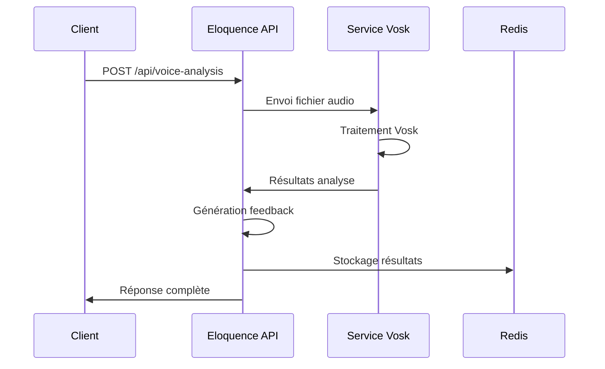

# 📋 Documentation - Endpoints d'Analyse Vocale avec Vosk

## 🎯 Aperçu

Cette documentation décrit les nouveaux endpoints d'analyse vocale ajoutés à l'API Eloquence Exercises. Ces endpoints utilisent le service Vosk pour fournir une analyse complète de la parole avec des métriques détaillées et des feedbacks personnalisés.

## 📊 Architecture

```
┌─────────────────────┐    ┌─────────────────────┐    ┌─────────────────────┐
│                     │    │                     │    │                     │
│  Client/Flutter     │───▶│ Eloquence-Exercises │───▶│    Service Vosk     │
│                     │    │       API           │    │     (Port 8002)     │
│                     │    │    (Port 8005)      │    │                     │
└─────────────────────┘    └─────────────────────┘    └─────────────────────┘
                                        │
                                        ▼
                             ┌─────────────────────┐
                             │                     │
                             │       Redis         │
                             │   (Stockage)        │
                             │                     │
                             └─────────────────────┘
```

## 🚀 Endpoints Disponibles

### 1. `/api/voice-analysis` (POST)

**Description :** Endpoint d'analyse vocale de base utilisant Vosk

**URL :** `http://localhost:8005/api/voice-analysis`

**Méthode :** `POST`

**Type de contenu :** `multipart/form-data`

#### Paramètres

| Paramètre | Type | Requis | Description |
|-----------|------|--------|-------------|
| `audio` | File | ✅ Oui | Fichier audio (WAV, MP3, etc.) |
| `session_id` | String | ❌ Non | ID de session (généré automatiquement si omis) |
| `exercise_type` | String | ❌ Non | Type d'exercice (`general`, `conversation`, etc.) |
| `user_id` | String | ❌ Non | ID utilisateur (`anonymous` par défaut) |

#### Exemple de requête

```bash
curl -X POST "http://localhost:8005/api/voice-analysis" \
  -F "audio=@test_audio.wav" \
  -F "session_id=session_001" \
  -F "exercise_type=conversation" \
  -F "user_id=user123"
```

#### Réponse

```json
{
  "session_id": "session_001",
  "timestamp": "2024-01-15T10:30:00.000Z",
  "transcription": "Bonjour, comment allez-vous aujourd'hui ?",
  "confidence_score": 0.87,
  "metrics": {
    "clarity": 0.85,
    "fluency": 0.82,
    "confidence": 0.87,
    "energy": 0.75,
    "overall": 83.2
  },
  "prosody": {
    "pitch_mean": 180.5,
    "pitch_std": 25.3,
    "energy_mean": 0.65,
    "energy_std": 0.12,
    "speaking_rate": 145.8,
    "pause_ratio": 0.15,
    "voice_quality": 0.88
  },
  "feedback": "Excellente performance ! Votre communication est claire, fluide et engageante.",
  "strengths": [
    "Excellente articulation et prononciation",
    "Débit de parole fluide et naturel"
  ],
  "improvements": [
    "Varier davantage l'intonation"
  ],
  "exercise_type": "conversation",
  "user_id": "user123",
  "processing_time": 2.45
}
```

### 2. `/api/voice-analysis/detailed` (POST)

**Description :** Endpoint d'analyse vocale avancée avec métriques détaillées et feedback personnalisé

**URL :** `http://localhost:8005/api/voice-analysis/detailed`

**Méthode :** `POST`

**Type de contenu :** `multipart/form-data`

#### Paramètres

Identiques à l'endpoint de base.

#### Réponse Enrichie

En plus des champs de base, cet endpoint fournit :

```json
{
  // ... tous les champs de base +
  "metrics": {
    "clarity": 0.85,
    "fluency": 0.82,
    "confidence": 0.87,
    "energy": 0.75,
    "overall": 83.2,
    "vocabulary_richness": 0.78,
    "hesitation_rate": 0.12,
    "articulation_score": 0.89
  },
  "word_analysis": [
    {
      "word": "bonjour",
      "start": 0.5,
      "end": 1.2,
      "conf": 0.95
    }
  ],
  "detailed_feedback": {
    "clarity": "Excellente articulation ! Votre discours est clair et bien prononcé.",
    "fluency": "Votre fluidité est correcte. Quelques pauses occasionnelles, mais le discours reste agréable.",
    "energy": "Votre niveau d'énergie est correct. Continuez à travailler sur l'expressivité.",
    "exercise_specific": "Pour les exercices conversationnels, maintenez un ton naturel et réactif."
  }
}
```

## 📈 Métriques Détaillées

### Métriques de Base

| Métrique | Description | Plage | Calcul |
|----------|-------------|-------|--------|
| `clarity` | Clarté de l'articulation | 0.0 - 1.0 | Basé sur la confiance de reconnaissance |
| `fluency` | Fluidité du discours | 0.0 - 1.0 | Analysé via les pauses et le rythme |
| `confidence` | Score de confiance global | 0.0 - 1.0 | Moyenne des confidences par mot |
| `energy` | Variation d'intonation | 0.0 - 1.0 | Basé sur les variations d'énergie |
| `overall` | Score global | 0 - 100 | Moyenne pondérée de toutes les métriques |

### Métriques Avancées (Endpoint Détaillé)

| Métrique | Description | Plage | Calcul |
|----------|-------------|-------|--------|
| `vocabulary_richness` | Richesse du vocabulaire | 0.0 - 1.0 | Ratio mots uniques / mots totaux |
| `hesitation_rate` | Taux d'hésitation | 0.0 - 1.0 | Basé sur les pauses longues |
| `articulation_score` | Score d'articulation | 0.0 - 1.0 | Précision de prononciation |

## 🎯 Types d'Exercices Supportés

| Type | Description | Feedback Spécialisé |
|------|-------------|-------------------|
| `general` | Analyse générale | Feedback standard |
| `conversation` | Exercice conversationnel | Focus sur le naturel et la réactivité |
| `presentation` | Présentation publique | Focus sur la projection vocale |
| `articulation` | Exercice d'articulation | Focus sur la précision des syllables |

## 🔧 Intégration avec l'Infrastructure

### Services Requis

1. **Redis** (Port 6379) - Stockage des analyses
2. **Service Vosk** (Port 8002) - Traitement audio
3. **Eloquence Exercises API** (Port 8005) - Endpoints principaux

### Configuration Docker

L'endpoint utilise la configuration suivante dans [`docker-compose.yml`](../../docker-compose.yml) :

```yaml
eloquence-exercises-api:
  environment:
    - VOSK_SERVICE_URL=http://vosk-stt:8002
    - REDIS_URL=redis://redis:6379/0
  depends_on:
    - vosk-stt
    - redis
```

## 🧪 Tests et Validation

### Script de Test

Un script de test complet est fourni : [`test_voice_analysis_simple.py`](test_voice_analysis_simple.py)

```bash
# Exécuter les tests
python services/eloquence-exercises-api/test_voice_analysis_simple.py
```

### Tests Automatisés

Le script teste :

- ✅ Connectivité des services (Health checks)
- ✅ Endpoint d'analyse de base
- ✅ Endpoint d'analyse détaillée
- ✅ Gestion d'erreurs
- ✅ Mise à jour des statistiques

## 🚨 Gestion d'Erreurs

### Codes d'Erreur

| Code | Description | Cause |
|------|-------------|-------|
| 400 | Requête invalide | Fichier audio manquant |
| 422 | Erreur de validation | Paramètres invalides |
| 500 | Erreur serveur | Problème avec Vosk ou Redis |
| 503 | Service indisponible | Service Vosk inaccessible |

### Exemple de Réponse d'Erreur

```json
{
  "detail": "Erreur d'analyse: Service Vosk inaccessible"
}
```

## 💾 Stockage Redis

### Clés de Stockage

- `eloquence:voice_analysis:{session_id}` - Analyses de base
- `eloquence:voice_analysis_detailed:{session_id}` - Analyses détaillées

### Expiration

- **TTL :** 24 heures (86400 secondes)
- **Nettoyage :** Automatique par Redis

## 📊 Statistiques

Les analyses sont comptabilisées dans l'endpoint [`/api/statistics`](app.py) :

```json
{
  "voice_analyses_total": 42,
  "exercises_total": 15,
  "sessions_total": 28,
  "completion_rate": 75.5
}
```

## 🔄 Flux de Traitement



## 🚀 Performances

### Temps de Traitement Typiques

| Durée Audio | Traitement Vosk | Traitement Total |
|-------------|----------------|------------------|
| 2-3 secondes | ~1-2s | ~2-3s |
| 5-10 secondes | ~3-5s | ~4-6s |
| 15-30 secondes | ~8-15s | ~10-18s |

### Optimisations

- ✅ Traitement asynchrone avec `httpx.AsyncClient`
- ✅ Timeouts appropriés (30s standard, 45s détaillé)
- ✅ Stockage Redis avec expiration
- ✅ Gestion d'erreurs robuste

## 🔧 Configuration Avancée

### Variables d'Environnement

```bash
VOSK_SERVICE_URL=http://vosk-stt:8002
REDIS_URL=redis://redis:6379/0
```

### Paramètres de Timeout

- **Analyse de base :** 30 secondes
- **Analyse détaillée :** 45 secondes
- **Health checks :** 10 secondes

## 📚 Exemples d'Utilisation

### Python (requests)

```python
import requests

# Analyse de base
with open('audio.wav', 'rb') as f:
    response = requests.post(
        'http://localhost:8005/api/voice-analysis',
        files={'audio': f},
        data={
            'exercise_type': 'conversation',
            'user_id': 'user123'
        }
    )
    result = response.json()
    print(f"Score global: {result['metrics']['overall']}")
```

### Flutter (http)

```dart
import 'package:http/http.dart' as http;

Future<Map<String, dynamic>> analyzeVoice(File audioFile) async {
  var request = http.MultipartRequest(
    'POST', 
    Uri.parse('http://localhost:8005/api/voice-analysis')
  );
  
  request.files.add(await http.MultipartFile.fromPath(
    'audio', 
    audioFile.path
  ));
  
  request.fields['exercise_type'] = 'conversation';
  
  var response = await request.send();
  var responseData = await response.stream.bytesToString();
  
  return json.decode(responseData);
}
```

## 🔄 Migration et Mise à Jour

### Compatibilité

- ✅ Compatible avec l'architecture LiveKit existante
- ✅ Réutilise l'infrastructure Redis et Docker
- ✅ Intégration transparente avec l'API existante

### Rollback

En cas de problème, supprimez simplement les endpoints des routes FastAPI.

---

## 📞 Support et Dépannage

### Vérifications de Base

1. **Services actifs :**
   ```bash
   curl http://localhost:8005/health
   curl http://localhost:8002/health
   ```

2. **Logs Docker :**
   ```bash
   docker-compose logs eloquence-exercises-api
   docker-compose logs vosk-stt
   ```

3. **Test de connectivité :**
   ```bash
   python services/eloquence-exercises-api/test_voice_analysis_simple.py
   ```

### Problèmes Fréquents

| Problème | Cause | Solution |
|----------|-------|----------|
| Timeout | Service Vosk lent | Augmenter timeout ou optimiser audio |
| 503 Error | Service Vosk indisponible | Redémarrer `vosk-stt` container |
| Analyse vide | Audio incompatible | Vérifier format audio (WAV 16kHz recommandé) |

---

**🎉 Les endpoints d'analyse vocale avec Vosk sont maintenant opérationnels et prêts à être utilisés dans votre application Eloquence !**