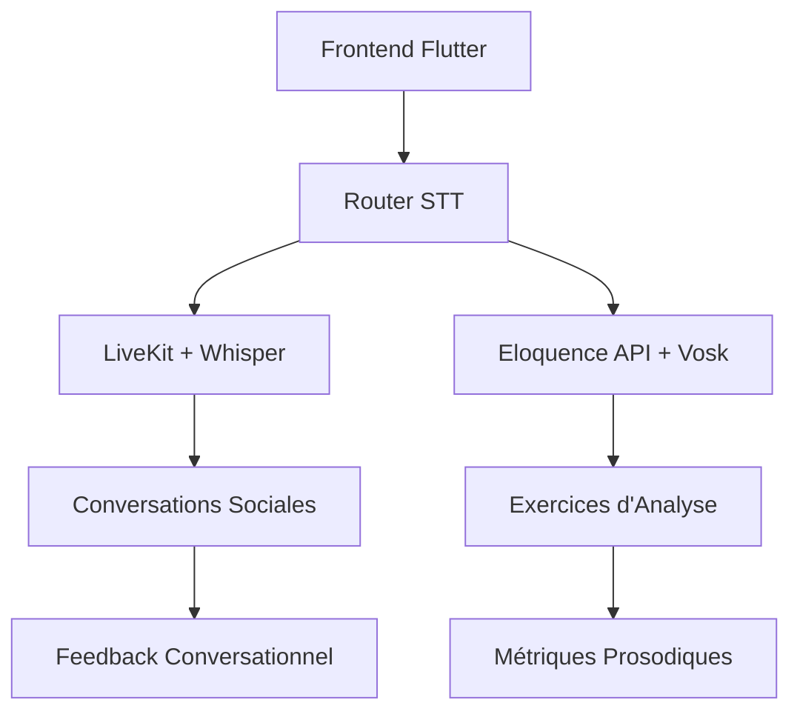

# Comparaison Architecture STT : Vosk vs Whisper

## Contexte Actuel

### Architecture Existante
- **LiveKit** : Utilise Whisper d'OpenAI pour le STT
- **API Eloquence Exercises** : Utilise Vosk pour l'analyse vocale

### Question Architecturale
Faut-il unifier sur Whisper ou maintenir Vosk pour l'analyse vocale spécialisée ?

## 📊 Analyse Comparative

### 1. **Whisper (OpenAI)**

#### ✅ Avantages
- **Qualité supérieure** : Transcription plus précise, surtout pour les accents
- **Multilingue natif** : Support excellent de nombreuses langues
- **Robustesse** : Gestion des bruits de fond, qualité audio variable
- **Cohérence** : Déjà utilisé dans LiveKit
- **Mise à jour continue** : Améliorations régulières d'OpenAI

#### ❌ Inconvénients
- **Coût** : API payante (usage intensif peut être coûteux)
- **Latence** : Appels API réseau (100-300ms supplémentaires)
- **Dépendance externe** : Connexion internet requise
- **Limite de taux** : Restrictions d'API possible
- **Confidentialité** : Données envoyées à OpenAI

### 2. **Vosk (Open Source)**

#### ✅ Avantages
- **Gratuit** : Pas de coûts d'API
- **Local** : Traitement on-premise, confidentialité garantie
- **Faible latence** : Pas d'appels réseau
- **Contrôle total** : Modèles personnalisables
- **Offline** : Fonctionne sans internet
- **Streaming natif** : Optimisé pour le temps réel

#### ❌ Inconvénients
- **Qualité variable** : Moins précis que Whisper sur certains cas
- **Ressources** : Consomme plus de CPU/RAM
- **Maintenance** : Gestion des modèles en interne
- **Moins multilingue** : Support limité de certaines langues
- **Mise à jour manuelle** : Nouveaux modèles à intégrer manuellement

## 🎯 Recommandations par Cas d'Usage

### **Pour l'Analyse Vocale Spécialisée (Eloquence Exercises)**
**Recommandation : Maintenir Vosk**

**Raisons :**
1. **Temps réel critique** : Latence minimale essentielle
2. **Volume élevé** : Coûts Whisper prohibitifs pour usage intensif
3. **Métriques spécialisées** : Vosk permet accès aux données acoustiques brutes
4. **Confidentialité** : Données vocales sensibles restent locales
5. **Contrôle** : Possibilité d'optimiser pour l'analyse prosodique

### **Pour les Conversations LiveKit**
**Recommandation : Conserver Whisper**

**Raisons :**
1. **Qualité conversationnelle** : Meilleure compréhension du contexte
2. **Usage ponctuel** : Coûts acceptables pour sessions ponctuelles
3. **Robustesse** : Gestion excellent des conditions variables
4. **Déjà intégré** : Pas de refactoring nécessaire

## 🏗️ Architecture Hybride Recommandée

### **Stratégie Duale**


### **Répartition des Responsabilités**

| Service | STT Engine | Cas d'Usage | Avantages |
|---------|------------|-------------|-----------|
| **LiveKit** | Whisper | Conversations, Échanges sociaux | Qualité, Contextuel |
| **Eloquence API** | Vosk | Exercices, Analyse vocale | Temps réel, Local, Métriques |

## 📋 Plan de Migration (Si Unification Souhaitée)

### **Option A : Tout vers Whisper**
```bash
# Avantages
+ Cohérence architecturale
+ Qualité uniforme
+ Maintenance simplifiée

# Inconvénients
- Coûts exponentiels
- Latence accrue
- Dépendance externe

# Estimation coûts mensuels
Exercices quotidiens (1000 utilisateurs): ~$500-1000/mois
```

### **Option B : Tout vers Vosk**
```bash
# Avantages
+ Coûts maîtrisés
+ Contrôle total
+ Performance locale

# Inconvénients
- Qualité conversationnelle réduite
- Refactoring LiveKit nécessaire
- Maintenance modèles

# Effort de migration
LiveKit vers Vosk: ~2-3 semaines développement
```

## 🎯 Recommandation Finale

### **Maintenir l'Architecture Hybride**

**Justification :**
1. **Spécialisation optimale** : Chaque engine pour son domaine
2. **Équilibre coût/performance** : Vosk pour le volume, Whisper pour la qualité
3. **Évolutivité** : Possibilité de migrer graduellement
4. **Robustesse** : Redondance des services STT

### **Améliorations Proposées**

#### 1. **Service Router STT Intelligent**
```python
class STTRouter:
    def select_engine(self, context):
        if context.type == "exercise":
            return VoskService()
        elif context.type == "conversation":
            return WhisperService()
        elif context.priority == "cost":
            return VoskService()
        elif context.priority == "quality":
            return WhisperService()
```

#### 2. **Fallback Strategy**
- **Primaire** : Vosk pour exercices, Whisper pour conversations
- **Secondaire** : Basculement automatique si service indisponible
- **Cache** : Résultats fréquents en Redis

#### 3. **Monitoring Unifié**
```python
# Métriques communes
- latency_ms
- accuracy_score  
- cost_per_request
- availability_percent
```

## 🔧 Implémentation Technique

### **Adapter l'API Eloquence pour Support Hybride**

```python
# Configuration flexible
STT_CONFIG = {
    "default_engine": "vosk",
    "fallback_engine": "whisper",
    "route_by_context": True,
    "cost_threshold": 100  # requêtes/jour avant fallback
}

# Usage contextuel
@app.post("/api/voice-analysis")
async def analyze_voice(context: str = "exercise"):
    engine = stt_router.select_engine(context)
    return await engine.process(audio)
```

### **Optimisation LiveKit Existant**

```python
# Garder Whisper mais optimiser
whisper_config = {
    "model": "base",  # Plus rapide que large
    "language": "fr",  # Forcer français
    "cache_results": True
}
```

## 📊 Métriques de Décision

### **KPIs à Surveiller**
- **Coût par utilisateur/mois**
- **Latence moyenne par type d'usage**
- **Satisfaction utilisateur (qualité STT)**
- **Disponibilité des services**

### **Seuils de Révision**
- Coût Whisper > 50€/utilisateur/mois → Migrer vers Vosk
- Latence Vosk > 500ms → Optimiser ou migrer vers Whisper
- Accuracy Vosk < 85% → Considérer Whisper pour exercices

## 🚀 Plan d'Action Recommandé

### **Phase 1 : Maintien Status Quo (Immédiat)**
- [x] Conserver Vosk pour Eloquence API
- [x] Conserver Whisper pour LiveKit
- [ ] Documenter l'architecture hybride
- [ ] Implémenter monitoring unifié

### **Phase 2 : Optimisation (1-2 mois)**
- [ ] Router STT intelligent
- [ ] Stratégie de fallback
- [ ] Cache résultats fréquents
- [ ] Métriques coût/performance

### **Phase 3 : Évolution (3-6 mois)**
- [ ] Évaluation basée sur métriques
- [ ] Migration ciblée si nécessaire
- [ ] Optimisation modèles Vosk français
- [ ] Tests A/B Whisper vs Vosk

---

**Conclusion** : L'architecture hybride actuelle est optimale. Vosk excelle pour l'analyse vocale intensive et temps réel, Whisper pour les conversations de qualité. Cette spécialisation maximise les avantages de chaque technologie.