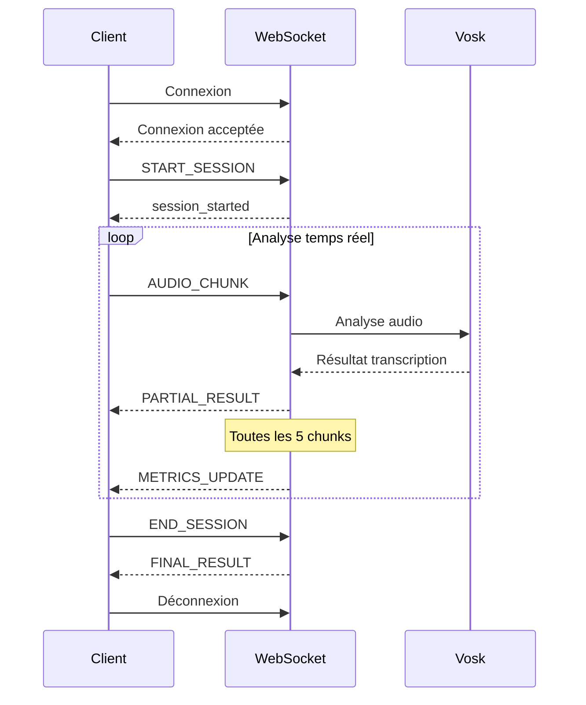

# Guide WebSocket - Analyse Vocale Temps Réel

## Vue d'ensemble

L'API Eloquence Exercises propose un endpoint WebSocket pour l'analyse vocale en temps réel, permettant une communication bidirectionnelle continue pour traiter et analyser la parole de manière fluide.

## Endpoint WebSocket

```
ws://localhost:8001/ws/voice-analysis/{session_id}
```

### Paramètres

- `session_id` (string) : Identifiant unique de la session d'analyse temps réel

## Protocole de Communication

### 1. Flux de Communication Standard



## Types de Messages

### 1. Messages Entrants (Client → Serveur)

#### START_SESSION
Initialise une nouvelle session d'analyse temps réel.

```json
{
  "type": "START_SESSION",
  "session_id": "session_unique_123",
  "exercise_type": "pronunciation_practice",
  "user_id": "user_456",
  "settings": {
    "target_language": "fr",
    "difficulty_level": "intermediate"
  }
}
```

**Champs requis :**
- `type` : "START_SESSION"
- `session_id` : Identifiant unique de la session
- `exercise_type` : Type d'exercice (pronunciation_practice, fluency_training, etc.)
- `user_id` : Identifiant de l'utilisateur

**Champs optionnels :**
- `settings` : Configuration spécifique de l'exercice

#### AUDIO_CHUNK
Envoie un chunk audio pour analyse.

```json
{
  "type": "AUDIO_CHUNK",
  "session_id": "session_unique_123",
  "chunk_id": 42,
  "audio_data": "UklGRjIAAABXQVZFZm10IBAAAAABAAEA...",
  "timestamp": "2025-01-26T10:30:45.123Z",
  "metadata": {
    "duration": 0.5,
    "sample_rate": 16000,
    "channels": 1
  }
}
```

**Champs requis :**
- `type` : "AUDIO_CHUNK"
- `session_id` : Identifiant de la session
- `chunk_id` : Numéro séquentiel du chunk
- `audio_data` : Données audio encodées en base64 (format WAV)
- `timestamp` : Horodatage ISO 8601

**Champs optionnels :**
- `metadata` : Métadonnées audio (durée, échantillonnage, etc.)

#### END_SESSION
Termine la session et demande les résultats finaux.

```json
{
  "type": "END_SESSION",
  "session_id": "session_unique_123",
  "timestamp": "2025-01-26T10:31:30.456Z"
}
```

### 2. Messages Sortants (Serveur → Client)

#### session_started
Confirmation de démarrage de session.

```json
{
  "type": "session_started",
  "session_id": "session_unique_123",
  "timestamp": "2025-01-26T10:30:45.123Z"
}
```

#### PARTIAL_RESULT
Résultat partiel d'analyse d'un chunk audio.

```json
{
  "type": "PARTIAL_RESULT",
  "session_id": "session_unique_123",
  "chunk_id": 42,
  "transcription": "bonjour comment allez-vous",
  "confidence": 0.87,
  "timestamp": "2025-01-26T10:30:45.678Z",
  "partial_metrics": {
    "chunk_confidence": 0.87,
    "chunk_duration": 0.5
  }
}
```

#### METRICS_UPDATE
Mise à jour des métriques temps réel (envoyée toutes les 5 chunks).

```json
{
  "type": "METRICS_UPDATE",
  "session_id": "session_unique_123",
  "timestamp": "2025-01-26T10:30:48.123Z",
  "clarity_score": 0.83,
  "fluency_score": 0.76,
  "energy_score": 0.62,
  "speaking_rate": 142.5,
  "pause_ratio": 0.18,
  "cumulative_confidence": 0.81
}
```

#### FINAL_RESULT
Résultat final complet de la session.

```json
{
  "type": "FINAL_RESULT",
  "session_id": "session_unique_123",
  "total_duration": 25.3,
  "final_transcription": "bonjour comment allez-vous aujourd'hui",
  "overall_metrics": {
    "clarity_score": 0.85,
    "fluency_score": 0.78,
    "energy_score": 0.65,
    "speaking_rate": 138.2,
    "pause_ratio": 0.22,
    "cumulative_confidence": 0.82
  },
  "strengths": [
    "Excellente clarté de prononciation",
    "Débit de parole optimal"
  ],
  "improvements": [
    "Réduire les pauses"
  ],
  "feedback": "Session de 25.3s avec 50 chunks analysés.",
  "processing_time": 0.0
}
```

#### ERROR
Message d'erreur en cas de problème.

```json
{
  "type": "ERROR",
  "session_id": "session_unique_123",
  "error_code": "INVALID_JSON",
  "error_message": "Format JSON invalide",
  "timestamp": "2025-01-26T10:30:45.123Z"
}
```

## Format Audio Requis

### Spécifications Audio
- **Format** : WAV (PCM non compressé)
- **Échantillonnage** : 16 kHz (recommandé)
- **Channels** : 1 (mono)
- **Bit depth** : 16 bits
- **Encodage** : Base64

### Durée des Chunks
- **Recommandée** : 0.5 secondes (500ms)
- **Minimum** : 0.1 secondes
- **Maximum** : 2.0 secondes

### Exemple de Préparation Audio (Python)

```python
import wave
import base64
import io

def prepare_audio_chunk(audio_data: bytes, sample_rate: int = 16000) -> str:
    """Prépare un chunk audio pour envoi WebSocket"""
    # Créer un fichier WAV en mémoire
    wav_buffer = io.BytesIO()
    with wave.open(wav_buffer, 'wb') as wav_file:
        wav_file.setnchannels(1)  # Mono
        wav_file.setsampwidth(2)  # 16 bits
        wav_file.setframerate(sample_rate)
        wav_file.writeframes(audio_data)
    
    # Encoder en base64
    wav_data = wav_buffer.getvalue()
    return base64.b64encode(wav_data).decode('utf-8')
```

## Métriques Temps Réel

### Description des Métriques

| Métrique | Description | Plage | Interprétation |
|----------|-------------|-------|----------------|
| `clarity_score` | Clarté de prononciation | 0.0 - 1.0 | Basé sur la confiance de transcription |
| `fluency_score` | Fluidité de la parole | 0.0 - 1.0 | Inverse du ratio de pauses |
| `energy_score` | Énergie/dynamisme | 0.0 - 1.0 | Basé sur le débit de parole |
| `speaking_rate` | Débit en mots/minute | 0+ | Vitesse d'élocution |
| `pause_ratio` | Ratio de pauses | 0.0 - 1.0 | Proportion de chunks silencieux |
| `cumulative_confidence` | Confiance moyenne | 0.0 - 1.0 | Confiance globale |

### Interprétation des Scores

**Clarity Score (Clarté)**
- `0.8 - 1.0` : Excellente clarté
- `0.6 - 0.8` : Bonne clarté
- `0.4 - 0.6` : Clarté modérée
- `< 0.4` : Amélioration nécessaire

**Speaking Rate (Débit)**
- `120 - 160 mots/min` : Optimal
- `100 - 120 mots/min` : Lent mais acceptable
- `160 - 200 mots/min` : Rapide mais compréhensible
- `< 100 ou > 200 mots/min` : À ajuster

## Gestion d'Erreurs

### Codes d'Erreur Communs

| Code | Description | Action recommandée |
|------|-------------|-------------------|
| `INVALID_JSON` | Format JSON invalide | Vérifier la structure du message |
| `MISSING_FIELD` | Champ requis manquant | Ajouter les champs obligatoires |
| `VOSK_ERROR` | Erreur service Vosk | Vérifier la connectivité Vosk |
| `AUDIO_FORMAT_ERROR` | Format audio invalide | Vérifier l'encodage base64/WAV |
| `SESSION_NOT_FOUND` | Session inconnue | Démarrer une nouvelle session |
| `PROCESSING_ERROR` | Erreur de traitement | Réessayer ou contacter le support |

### Stratégies de Récupération

1. **Reconnexion automatique** : En cas de déconnexion
2. **Retry logic** : Pour les erreurs temporaires
3. **Validation côté client** : Avant envoi des messages
4. **Bufferisation** : Pour gérer les latences réseau

## Exemples d'Utilisation

### Exemple Python (Client)

```python
import asyncio
import websockets
import json
import base64

async def realtime_voice_analysis():
    uri = "ws://localhost:8001/ws/voice-analysis/my_session_123"
    
    async with websockets.connect(uri) as websocket:
        # 1. Démarrer la session
        start_msg = {
            "type": "START_SESSION",
            "session_id": "my_session_123",
            "exercise_type": "pronunciation_practice",
            "user_id": "user_456"
        }
        await websocket.send(json.dumps(start_msg))
        
        # Attendre confirmation
        response = await websocket.recv()
        print(f"Session started: {response}")
        
        # 2. Envoyer des chunks audio
        for chunk_id in range(1, 11):
            # Préparer chunk audio (exemple)
            audio_data = prepare_audio_chunk(get_audio_data())
            
            chunk_msg = {
                "type": "AUDIO_CHUNK",
                "session_id": "my_session_123",
                "chunk_id": chunk_id,
                "audio_data": audio_data,
                "timestamp": datetime.now().isoformat()
            }
            await websocket.send(json.dumps(chunk_msg))
            
            # Recevoir résultat partiel
            result = await websocket.recv()
            partial = json.loads(result)
            print(f"Chunk {chunk_id}: {partial.get('transcription')}")
        
        # 3. Terminer la session
        end_msg = {
            "type": "END_SESSION",
            "session_id": "my_session_123",
            "timestamp": datetime.now().isoformat()
        }
        await websocket.send(json.dumps(end_msg))
        
        # Recevoir résultat final
        final_result = await websocket.recv()
        print(f"Final result: {final_result}")

# Exécuter
asyncio.run(realtime_voice_analysis())
```

### Exemple JavaScript (Browser)

```javascript
class RealtimeVoiceAnalyzer {
    constructor(sessionId) {
        this.sessionId = sessionId;
        this.websocket = null;
    }
    
    async connect() {
        const url = `ws://localhost:8001/ws/voice-analysis/${this.sessionId}`;
        this.websocket = new WebSocket(url);
        
        this.websocket.onopen = () => {
            console.log('🔌 WebSocket connecté');
            this.startSession();
        };
        
        this.websocket.onmessage = (event) => {
            const message = JSON.parse(event.data);
            this.handleMessage(message);
        };
        
        this.websocket.onerror = (error) => {
            console.error('❌ Erreur WebSocket:', error);
        };
    }
    
    startSession() {
        const message = {
            type: 'START_SESSION',
            session_id: this.sessionId,
            exercise_type: 'pronunciation_practice',
            user_id: 'user_123'
        };
        this.websocket.send(JSON.stringify(message));
    }
    
    sendAudioChunk(audioBlob, chunkId) {
        const reader = new FileReader();
        reader.onload = () => {
            const base64Audio = btoa(reader.result);
            const message = {
                type: 'AUDIO_CHUNK',
                session_id: this.sessionId,
                chunk_id: chunkId,
                audio_data: base64Audio,
                timestamp: new Date().toISOString()
            };
            this.websocket.send(JSON.stringify(message));
        };
        reader.readAsBinaryString(audioBlob);
    }
    
    handleMessage(message) {
        switch(message.type) {
            case 'session_started':
                console.log('✅ Session démarrée');
                break;
            case 'PARTIAL_RESULT':
                console.log(`🎤 Transcription: ${message.transcription}`);
                break;
            case 'METRICS_UPDATE':
                console.log(`📊 Métriques:`, message);
                break;
            case 'FINAL_RESULT':
                console.log(`🎉 Résultat final:`, message);
                break;
            case 'ERROR':
                console.error(`❌ Erreur: ${message.error_message}`);
                break;
        }
    }
    
    endSession() {
        const message = {
            type: 'END_SESSION',
            session_id: this.sessionId,
            timestamp: new Date().toISOString()
        };
        this.websocket.send(JSON.stringify(message));
    }
}

// Utilisation
const analyzer = new RealtimeVoiceAnalyzer('session_456');
analyzer.connect();
```

## Tests et Validation

### Script de Test Inclus
Utilisez le script [`test_websocket_realtime.py`](./test_websocket_realtime.py) pour valider l'endpoint :

```bash
# Démarrer l'API
docker-compose up eloquence-exercises-api

# Exécuter les tests
cd services/eloquence-exercises-api
python test_websocket_realtime.py
```

### Tests Manuels avec Postman/Insomnia
1. Créer une connexion WebSocket vers `ws://localhost:8001/ws/voice-analysis/test_session`
2. Envoyer les messages selon le protocole défini
3. Vérifier les réponses et métriques

## Limitations et Considérations

### Performance
- **Latence** : ~100-500ms par chunk (selon la taille)
- **Throughput** : ~10-20 chunks/seconde maximum
- **Mémoire** : Chaque session active utilise ~50MB

### Contraintes Réseau
- **Bande passante** : ~64 kbps pour audio 16kHz mono
- **Timeout** : 5 secondes maximum par chunk
- **Buffer** : Chunks trop rapides peuvent être ignorés

### Sécurité
- **Authentification** : À implémenter selon les besoins
- **Rate limiting** : Pas encore implémenté
- **Validation** : Format audio strictement validé

## Support et Dépannage

### Logs Utiles
```bash
# Logs du service
docker-compose logs eloquence-exercises-api

# Logs Vosk
docker-compose logs vosk-stt-analysis
```

### Problèmes Fréquents

**Connexion WebSocket échoue**
- Vérifier que le service est démarré
- Contrôler les ports (8001)
- Tester la connectivité de base

**Audio non reconnu**
- Vérifier le format WAV + Base64
- Contrôler l'échantillonnage (16kHz)
- Valider la durée des chunks

**Métriques incohérentes**
- Vérifier la séquence des chunk_id
- Contrôler la temporisation des envois
- Valider la qualité audio source

---

*Documentation générée pour l'API Eloquence Exercises - Version WebSocket Temps Réel*